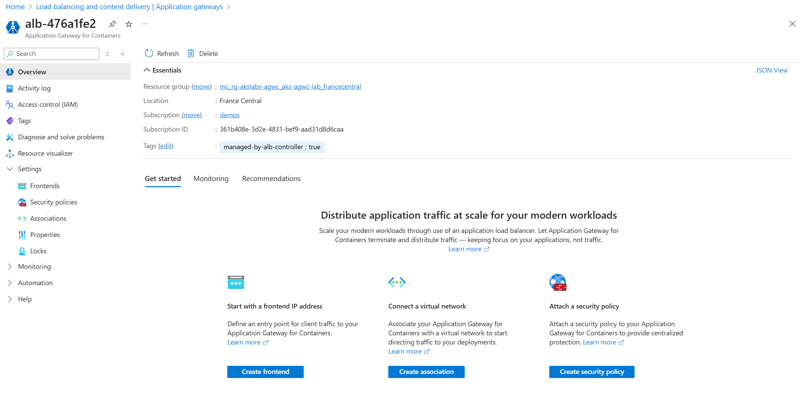
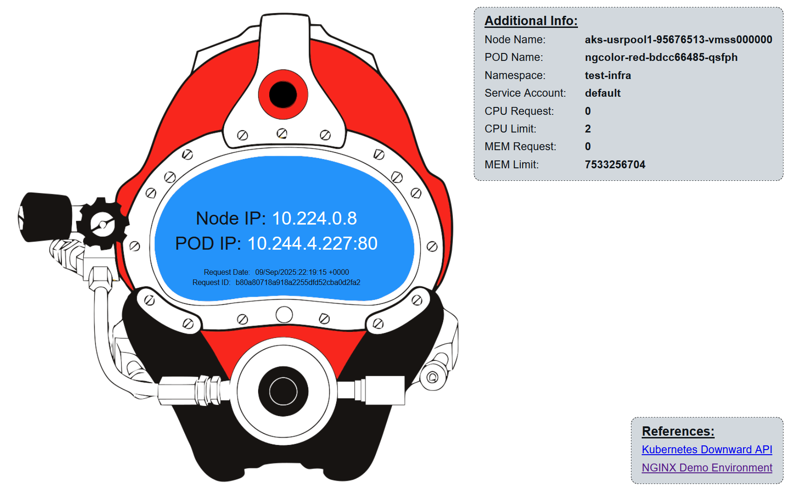
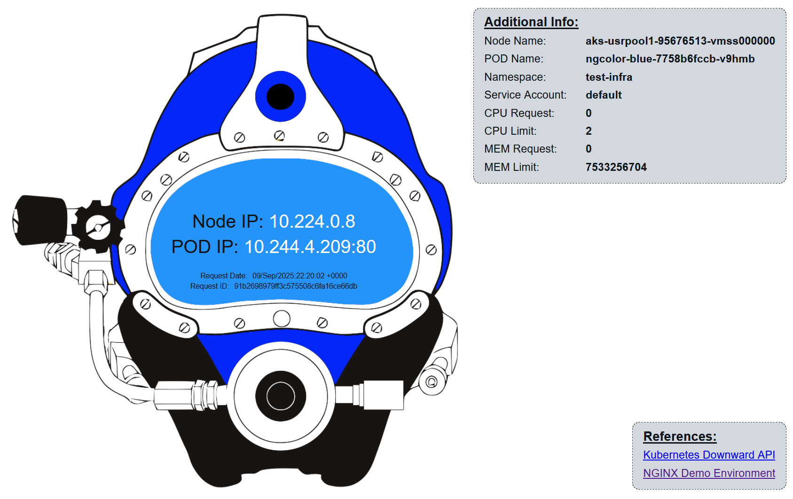

### Overview

Application Gateway for Containers is an application layer (layer 7) load balancing and dynamic traffic management product for workloads running in a Kubernetes cluster. It extends Azure's Application Load Balancing portfolio and is a new offering under the Application Gateway product family. It enables multiple Layer 7 features:

- Traffic splitting / Weighted round robin

- Mutual authentication to the backend target

- Kubernetes support for Ingress and Gateway API

- Flexible deployment strategies

- Increased performance, offering near real-time updates to add or remove pods, routes, and probes

---

### Objectives

In this workshop, you will learn how to use Application Gateway for Containers with Azure Kubernetes Service (AKS). 

* Deploy and configure an ALB controller.

* Create an Application Gateway for Containers resource via CRDs (managed by the ALB Controller).

* Install and configure cert-manager to manage and assign certificates to your workloads exposed via Application Gateway for Containers.

* Expose an application to the Internet over HTTPS.

* Apply Web Application Firewall Policies to your HTTPRoutes.

* Create a canary deployment by leveraging traffic splitting.

---

### Prerequisites
Before starting this lab, make sure your environment is set up correctly. Follow the guide here:

- [Azure Subscription](https://azure.microsoft.com/)
- [Azure CLI](https://learn.microsoft.com/en-us/cli/azure/) version 2.60.0 or later with the [aks-preview](https://github.com/Azure/azure-cli-extensions/tree/main/src/aks-preview) [Azure CLI extension](https://learn.microsoft.com/cli/azure/azure-cli-extensions-overview?view=azure-cli-latest) installed
- [kubectl](https://kubernetes.io/docs/tasks/tools/) version 1.28.9 or later
- A terminal with `bash` (e.g.: [Windows Terminal](https://www.microsoft.com/p/windows-terminal/9n0dx20hk701) with [WSL](https://docs.microsoft.com/windows/wsl/install-win10) or [Azure Cloud Shell](https://shell.azure.com/))


## Setup your environment


### Step 1: AKS Cluster Deployment

Please follow the instructions on [setting up your lab](https://azure-samples.github.io/aks-labs/docs/getting-started/setting-up-lab-environment). The AKS cluster needs to be in a region where Application Gateway for Containers is available AKS cluster should use Azure CNI or Azure CNI Overlay. AKS cluster should have the workload identity feature enabled. Learn how to enable workload identity on an existing AKS cluster.

### Step 2: Enable required providers for Application Gateway for Containers

Before starting with the deployment and configuration of the Application Gateway for Containers, you will need to register a few providers in the subscription which will contain the resources. You must also enable the extension "Application Gateway for Containers ALB Controller"

```bash
# Sign in to your Azure subscription.
SUBSCRIPTION_ID='<your subscription id>'
az login
az account set --subscription $SUBSCRIPTION_ID

# Register required resource providers on Azure.
az provider register --namespace Microsoft.ContainerService
az provider register --namespace Microsoft.Network
az provider register --namespace Microsoft.NetworkFunction
az provider register --namespace Microsoft.ServiceNetworking

# Install Azure CLI extensions.
az extension add --name alb
```

### Step 3: Install Helm CLI

If you don't have Helm installed in your client machine, do so with the following command:

```
curl https://raw.githubusercontent.com/helm/helm/main/scripts/get-helm-3 | bash
```


## Expose an application over HTTP

### Install and configure the ALB Controller

The ALB Controller is a Kubernetes deployment that orchestrates configuration and deployment of Application Gateway for Containers. It uses both ARM and configuration APIs to propagate configuration to the Application Gateway for Containers Azure deployment. [Each release of ALB Controller](https://learn.microsoft.com/en-us/azure/application-gateway/for-containers/alb-controller-release-notes) has a documented helm chart version and supported Kubernetes cluster version. After installing it in a cluster, it will apply a set of CRDs to the cluster (as of version 1.7.9):

- ApplicationLoadBalancer
- BackendLoadBalancingPolicy
- BackendTLSPolicy
- FrontendTLSPolicy
- HealthCheckPolicy
- IngressExtension
- RoutePolicy
- WebApplicationFirewallPolicy

#### Identity configuration

Create a user managed identity for ALB controller and federate the identity as Workload Identity to use in the AKS cluster.

```bash
IDENTITY_RESOURCE_NAME='azure-alb-identity2'

MC_RG_NAME=$(az aks show --resource-group ${RG_NAME} --name ${AKS_NAME} --query "nodeResourceGroup" -o tsv)
MC_RG_ID=$(az group show --name ${MC_RG_NAME} --query id -o tsv)

echo "Creating identity $IDENTITY_RESOURCE_NAME in resource group $RG_NAME"
az identity create --resource-group $RG_NAME --name $IDENTITY_RESOURCE_NAME
principalId="$(az identity show -g $RG_NAME -n $IDENTITY_RESOURCE_NAME --query principalId -otsv)"

echo "Waiting 60 seconds to allow for replication of the identity..."
sleep 60

echo "Apply Reader role to the AKS managed cluster resource group for the newly provisioned identity"
az role assignment create --assignee-object-id $principalId --assignee-principal-type ServicePrincipal --scope $MC_RG_ID --role "acdd72a7-3385-48ef-bd42-f606fba81ae7" # Reader role

echo "Set up federation with AKS OIDC issuer"
AKS_OIDC_ISSUER="$(az aks show -n $AKS_NAME -g $RG_NAME --query "oidcIssuerProfile.issuerUrl" -o tsv)"
az identity federated-credential create --name "azure-alb-identity2" --identity-name "$IDENTITY_RESOURCE_NAME" --resource-group $RG_NAME --issuer "$AKS_OIDC_ISSUER" --subject "system:serviceaccount:azure-alb-system:alb-controller-sa"
```

#### ALB Controller Installation with Helm

When the helm install command is run, it deploys the helm chart to the default namespace. When alb-controller is deployed, it deploys to the `azure-alb-system` namespace. Both of these namespaces may be overridden independently as desired. To override the namespace the helm chart is deployed to, you may specify the --namespace (or -n) parameter. To override the `azure-alb-system` namespace used by alb-controller, you may set the albController.namespace property during installation (--set albController.namespace). If neither the --namespace or the --set albController.namespace parameters are defined, the default namespace is used for the helm chart and the `azure-alb-system` namespace is used for the ALB controller components. Lastly, if the namespace for the helm chart resource isn't yet defined, ensure the --create-namespace parameter is also specified along with the --namespace or -n parameters. Install the ALB controller with Helm:

```bash
HELM_NAMESPACE='azure-alb-helm'
CONTROLLER_NAMESPACE='azure-alb-system'
az aks get-credentials --resource-group $RG_NAME --name $AKS_NAME
CLIENT_ID=$(az identity show -g $RG_NAME -n azure-alb-identity2 --query clientId -o tsv)
helm install alb-controller oci://mcr.microsoft.com/application-lb/charts/alb-controller --namespace $HELM_NAMESPACE --version 1.7.9 --set albController.namespace=$CONTROLLER_NAMESPACE --set albController.podIdentity.clientID=$CLIENT_ID --create-namespace
```

Verify the installation:

```bash
kubectl get pods -n azure-alb-system
```

Verify GatewayClass `azure-alb-external` is installed on your cluster. You should see that the GatewayClass has a condition that reads `Valid` GatewayClass:

```
kubectl get gatewayclass azure-alb-external -o yaml
```

Now that you have successfully installed an ALB Controller on your cluster, you can provision the Application Gateway For Containers resources in Azure.


### Provision a (managed) Application Gateway for Containers

In this deployment strategy, ALB Controller deployed in Kubernetes is responsible for the lifecycle of the Application Gateway for Containers resource and its sub resources. ALB Controller creates an Application Gateway for Containers resource when an ApplicationLoadBalancer custom resource is defined on the cluster. The service lifecycle is based on the lifecycle of the custom resource.


#### Prepare your virtual network / subnet

```bash
CLUSTER_SUBNET_ID=$(az vmss list --resource-group $MC_RG_NAME --query '[0].virtualMachineProfile.networkProfile.networkInterfaceConfigurations[0].ipConfigurations[0].subnet.id' -o tsv)
read -d '' VNET_NAME VNET_RG_NAME VNET_ID <<< $(az network vnet show --ids $CLUSTER_SUBNET_ID --query '[name, resourceGroup, id]' -o tsv
```

Run the following command to create a new subnet containing at least 250 available IP addresses and enable subnet delegation for the Application Gateway for Containers association resource:

```bash
SUBNET_ADDRESS_PREFIX='10.239.1.0/24'
ALB_SUBNET_NAME='subnet-alb' # subnet name can be any non-reserved subnet name (i.e. GatewaySubnet, AzureFirewallSubnet, AzureBastionSubnet would all be invalid)
az network vnet subnet create --resource-group $MC_RG_NAME --vnet-name $VNET_NAME --name $ALB_SUBNET_NAME --address-prefixes $SUBNET_ADDRESS_PREFIX --delegations 'Microsoft.ServiceNetworking/trafficControllers'
ALB_SUBNET_ID=$(az network vnet subnet show --name $ALB_SUBNET_NAME --resource-group $VNET_RG_NAME --vnet-name $VNET_NAME --query '[id]' --output tsv)
```

#### Delegate permissions to managed identity

```
IDENTITY_RESOURCE_NAME='azure-alb-identity2'

principalId=$(az identity show -g $RG_NAME -n $IDENTITY_RESOURCE_NAME --query principalId -otsv)

# Delegate AppGw for Containers Configuration Manager role to AKS Managed Cluster RG
az role assignment create --assignee-object-id $principalId --assignee-principal-type ServicePrincipal --scope $MC_RG_ID --role "fbc52c3f-28ad-4303-a892-8a056630b8f1"

# Delegate Network Contributor permission for join to association subnet
az role assignment create --assignee-object-id $principalId --assignee-principal-type ServicePrincipal --scope $ALB_SUBNET_ID --role "4d97b98b-1d4f-4787-a291-c67834d212e7"
```


#### Create an Application Load Balancer

When you create an ApplicationLoadBalancer (with API alb.networking.azure.io/v1), the ALB controller will create an Application Gateway for Containers resource in Azure. Let's first create a namespace:

```bash
kubectl create ns alb-test-infra
```

Now create an Application Load Balancer in the newly created namespace:

```yaml
kubectl apply -f -  <<EOF
apiVersion: alb.networking.azure.io/v1
kind: ApplicationLoadBalancer
metadata:
  name: alb-test
  namespace: alb-test-infra
spec:
  associations:
  - $ALB_SUBNET_ID
EOF
```

The ALB Controller deployed in Kubernetes is responsible for the lifecycle of the Application Gateway for Containers resource and its sub resources. ALB Controller creates the Application Gateway for Containers resource when an ApplicationLoadBalancer custom resource is defined on the cluster and its lifecycle is based on the lifecycle of the custom resource.


```
kubectl get applicationloadbalancer alb-test -n alb-test-infra -o yaml -w
```

You can now navigate to the Azure Portal, and visualize your managed Application Gateway for Containers:




### Create a Gateway with an HTTP listener

Every time a Gateway resource is created referencing the ApplicationLoadBalancer resource, ALB Controller provisions a new Frontend resource and manage its lifecycle based on the lifecycle of the Gateway resource.

```yaml
kubectl apply -f - <<EOF
apiVersion: gateway.networking.k8s.io/v1
kind: Gateway
metadata:
  name: gateway-01
  namespace: test-infra
  annotations:
    alb.networking.azure.io/alb-namespace: alb-test-infra
    alb.networking.azure.io/alb-name: alb-test
spec:
  gatewayClassName: azure-alb-external
  listeners:
  - name: http-listener
    protocol: HTTP
    port: 80
    allowedRoutes:
        namespaces:
          from: Same
EOF
```

### Deploy an example web server and expose it as HTTPRoute

Let's deploy an example nginx web server which we will first access via HTTP, and later on via HTTPS.

```yaml
kubectl apply -f - <<EOF
apiVersion: apps/v1
kind: Deployment
metadata:
  name: my-app
  namespace: test-infra
spec:
  replicas: 2
  selector:
    matchLabels:
      app: my-app
  template:
    metadata:
      labels:
        app: my-app
    spec:
      containers:
      - name: my-app
        image: nginx # or your app image
        ports:
        - containerPort: 80
---
apiVersion: v1
kind: Service
metadata:
  name: my-app
  namespace: test-infra
spec:
  selector:
    app: my-app
  ports:
  - port: 80
    targetPort: 80
EOF
```

We can now expose the application as HTTPRoute. First, get the address assign to the Gateway resource:

```bash
export YOUR_GATEWAY_ADDRESS=$(kubectl -n test-infra get gateway gateway-01 -o jsonpath='{.status.addresses[0].value}')
```

```yaml
kubectl apply -f - <<EOF
apiVersion: gateway.networking.k8s.io/v1
kind: HTTPRoute
metadata:
  name: https-example
  namespace: test-infra
spec:
  parentRefs:
  - name: gateway-01
  hostnames:
  - $YOUR_GATEWAY_ADDRESS
  rules:
  - matches:
    - path:
        type: PathPrefix
        value: /
    backendRefs:
    - name: my-app
      port: 80
EOF
```

You can test the access to the application:

```bash
curl http://$YOUR_GATEWAY_ADDRESS
```

## Expose an application over HTTPS

In the previous section you learnt how to expose your Kubernetes workloads through HTTP with Application Gateway for Containers. While the previous method allows you to access your applications, you are doing so in an insecure way. In order to secure your application traffic, it is necessary to expose it through HTTPS (which requires the use of SSL/TLS certificates).

### Install and configure Cert-Manager

[Cert-Manager](https://cert-manager.io/) is a powerful and extensible X.509 certificate controller for Kubernetes workloads, which obtains certificates from a variety of Issuers, both public or private, and ensure the certificates are valid and up-to-date. It will also attempt to renew certificates at a configured time before expiry. For the purposes of this lab, we have cert-manager configure certificates issued from Let's Encrypt to demonstrate an end-to-end deployment, where Application Gateway for Containers is providing TLS offloading.


In order to use it to manage certificates for our applications exposed through Application Gateway for Containers, we first need to install it with Helm:

```bash
helm repo add jetstack https://charts.jetstack.io --force-update
helm install \
  cert-manager jetstack/cert-manager \
  --namespace cert-manager \
  --create-namespace \
  --version v1.17.1 \
  --set config.enableGatewayAPI=true \
  --set crds.enabled=true
```

Create a `ClusterIssuer` resource to define how cert-manager will communicate with Let's Encrypt. For this example, an HTTP challenge is used. During challenge, cert-manager creates an HTTPRoute resource and corresponding pod presenting a validation endpoint to prove ownership of the domain.

```yaml
kubectl apply -f - <<EOF
apiVersion: cert-manager.io/v1
kind: ClusterIssuer
metadata:
  name: letsencrypt-prod
spec:
  acme:
    server: https://acme-v02.api.letsencrypt.org/directory # production endpoint
    email: your-email@example.com
    privateKeySecretRef:
      name: letsencrypt-private-key
    solvers:
      - http01:
          gatewayHTTPRoute:
            parentRefs:
              - name: gateway-01
                namespace: test-infra
                kind: Gateway
EOF
```

### Add an HTTPS listener to your existing Gateway

Modify the gateway to include a listener for HTTPS traffic:

```yaml
kubectl apply -f - <<EOF
apiVersion: gateway.networking.k8s.io/v1
kind: Gateway
metadata:
  name: gateway-01
  namespace: test-infra
  annotations:
    alb.networking.azure.io/alb-namespace: alb-test-infra
    alb.networking.azure.io/alb-name: alb-test
    cert-manager.io/issuer: letsencrypt-cert
spec:
  gatewayClassName: azure-alb-external
  listeners:
  - name: http-listener
    protocol: HTTP
    port: 80
    allowedRoutes:
        namespaces:
          from: Same
  - name: https-listener
    port: 443
    protocol: HTTPS
    tls:
      certificateRefs:
      - name: letsencrypt-secret
    allowedRoutes:
      namespaces:
        from: Same
EOF
```


## Protect your application with a Web Application Firewall Policy

Azure Web Application Firewall on Azure Application Gateway for Containers provides comprehensive protection for your Kubernetes workloads against common web vulnerabilities and attacks. For example, it addresses SQL injection, cross-site scripting (XSS), and other Open Web Application Security Project (OWASP) top 10 threats.

Let's start by creating a WAF Policy, and get the ID for future use:

```bash
export WAF_POLICY_NAME=waf-akslabs-agwc

az network application-gateway waf-policy create \
  --name ${WAF_POLICY_NAME} \
  --resource-group ${MC_RG_NAME} \
  --location $LOCATION \
  --enabled true \
  --firewall-mode Prevention

export WAF_POLICY_ID=$(az network application-gateway waf-policy show -n ${WAF_POLICY_NAME} -g ${MC_RG_NAME} --query id)
```

### Assign permissions to the managed identity

While the current permissions are sufficient for creating the WAF Policy, the ALB controller is unable to join the policy to the HTTP route. Add a Network Contributor role with a scope matching the WAF Policy you just created:

```bash
az role assignment create --assignee-object-id $principalId --assignee-principal-type ServicePrincipal --scope $WAF_POLICY_ID --role "4d97b98b-1d4f-4787-a291-c67834d212e7" # Network Contributor
```

Assign the WAF Policy to the HTTPRoute:

```yaml
kubectl apply -f - <<EOF
apiVersion: alb.networking.azure.io/v1
kind: WebApplicationFirewallPolicy
metadata:
  name: sample-waf-policy
  namespace: test-infra
spec:
  targetRef:
    group: gateway.networking.k8s.io
    kind: HTTPRoute
    name: https-example
    namespace: test-infra
  webApplicationFirewall: $WAF_POLICY_ID
EOF
```

## Implementing Canary deployments with Traffic Splitting

Canary deployments are a release strategy where a new version of software is gradually rolled out to a small subset of users before a full rollout. This approach minimizes risk by allowing teams to monitor performance and catch issues early. Application Gateway for Containers enables you to perform canary deployments thanks to its [traffic splitting feature](https://learn.microsoft.com/en-us/azure/application-gateway/for-containers/how-to-traffic-splitting-gateway-api?tabs=alb-managed). Traffic splitting is a technique which routes a portion of user traffic to the new version while the rest continues to use the stable one. This split can be adjusted dynamically; for example, starting with 5% of traffic and increasing as confidence grows. 

Let's first create two deployments with two services. While both will display the same information, one will display a red skuba mask, and the other one a blue one:

```yaml
kubectl apply -f - <<EOF
apiVersion: apps/v1
kind: Deployment
metadata:
  name: ngcolor-blue
  namespace: test-infra
spec:
  replicas: 1
  selector:
    matchLabels:
       target: ngcolor-blue
  template:
    metadata:
      name: ngcolor-blue
      labels:
        target: ngcolor-blue
    spec:
      nodeSelector:
        agentpool: usrpool1
      containers:
      - name: nginxcolordemo
        image: scubakiz/nginxcolordemo:blue-1.0
        ports:
        - containerPort: 80
          protocol: TCP
        env:
        - name: NODE_IP
          valueFrom:
            fieldRef:
              fieldPath: status.hostIP
        - name: NODE_NAME
          valueFrom:
            fieldRef:
              fieldPath: spec.nodeName
        - name: POD_NAMESPACE
          valueFrom:
            fieldRef:
              fieldPath: metadata.namespace
        - name: POD_SERVICE_ACCOUNT
          valueFrom:
            fieldRef:
              fieldPath: spec.serviceAccountName 
        - name: POD_CPU_REQUEST
          valueFrom:
            resourceFieldRef:
              containerName: nginxcolordemo
              resource: requests.cpu
        - name: POD_CPU_LIMIT
          valueFrom:
            resourceFieldRef:
              containerName: nginxcolordemo
              resource: limits.cpu
        - name: POD_MEM_REQUEST
          valueFrom:
            resourceFieldRef:
              containerName: nginxcolordemo
              resource: requests.memory
        - name: POD_MEM_LIMIT
          valueFrom:
            resourceFieldRef:
              containerName: nginxcolordemo
              resource: limits.memory 
        imagePullPolicy: Always
---          
apiVersion: v1
kind: Service
metadata:
  name: ngcolor-blue
  namespace: test-infra
spec:
  ports:
    - port: 8080
      targetPort: 80
  selector:
    target: ngcolor-blue
  type: ClusterIP
---
apiVersion: apps/v1
kind: Deployment
metadata:
  name: ngcolor-red
  namespace: test-infra
spec:
  replicas: 1
  selector:
    matchLabels:
       target: ngcolor-red
  template:
    metadata:
      name: ngcolor-red
      labels:
        target: ngcolor-red
    spec:
      nodeSelector:
        agentpool: usrpool1
      containers:
      - name: nginxcolordemo
        image: scubakiz/nginxcolordemo:red-1.0
        ports:
        - containerPort: 80
          protocol: TCP
        env:
        - name: NODE_IP
          valueFrom:
            fieldRef:
              fieldPath: status.hostIP
        - name: NODE_NAME
          valueFrom:
            fieldRef:
              fieldPath: spec.nodeName
        - name: POD_NAMESPACE
          valueFrom:
            fieldRef:
              fieldPath: metadata.namespace
        - name: POD_SERVICE_ACCOUNT
          valueFrom:
            fieldRef:
              fieldPath: spec.serviceAccountName 
        - name: POD_CPU_REQUEST
          valueFrom:
            resourceFieldRef:
              containerName: nginxcolordemo
              resource: requests.cpu
        - name: POD_CPU_LIMIT
          valueFrom:
            resourceFieldRef:
              containerName: nginxcolordemo
              resource: limits.cpu
        - name: POD_MEM_REQUEST
          valueFrom:
            resourceFieldRef:
              containerName: nginxcolordemo
              resource: requests.memory
        - name: POD_MEM_LIMIT
          valueFrom:
            resourceFieldRef:
              containerName: nginxcolordemo
              resource: limits.memory 
        imagePullPolicy: Always
---          
apiVersion: v1
kind: Service
metadata:
  name: ngcolor-red
  namespace: test-infra
spec:
  ports:
    - port: 8080
      targetPort: 80
  selector:
    target: ngcolor-red
  type: ClusterIP
EOF
```    

You can now expose the application, and assign weights to each service. In the example below, 50% of requests will be sent to `ngcolor-blue` service, and the other 50% to `ngcolor-red`.

```yaml
kubectl apply -f - <<EOF
apiVersion: gateway.networking.k8s.io/v1
kind: HTTPRoute
metadata:
  name: canary-ngcolor
  namespace: test-infra
spec:
  parentRefs:
  - name: gateway-01
  hostnames:
  - bbaeevezcnecffd0.fz64.alb.azure.com
  rules:
  - backendRefs:
    - name: ngcolor-blue
      port: 8080
      weight: 50
    - name: ngcolor-red
      port: 8080
      weight: 50
EOF
```

Open your browser and navigate to https://$YOUR_FRONTEND_ADDRESS:



50% of the times you will be redirected to the blue service instead:



---

## Authors

This lab was originally developed by Carlos Mestre del Pino. He can be reached at:

**LinkedIn:** [Carlos Mestre del Pino](https://www.linkedin.com/in/mestredelpino/) \
**BlueSky** [@mestredelpino.com](https://bsky.app/profile/mestredelpino.com) 

