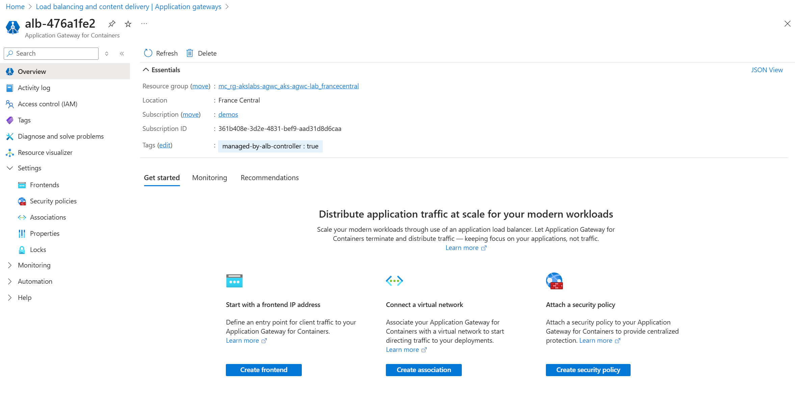
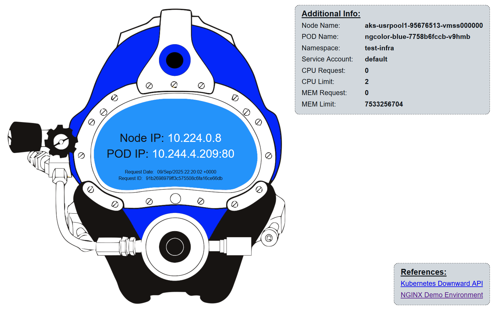
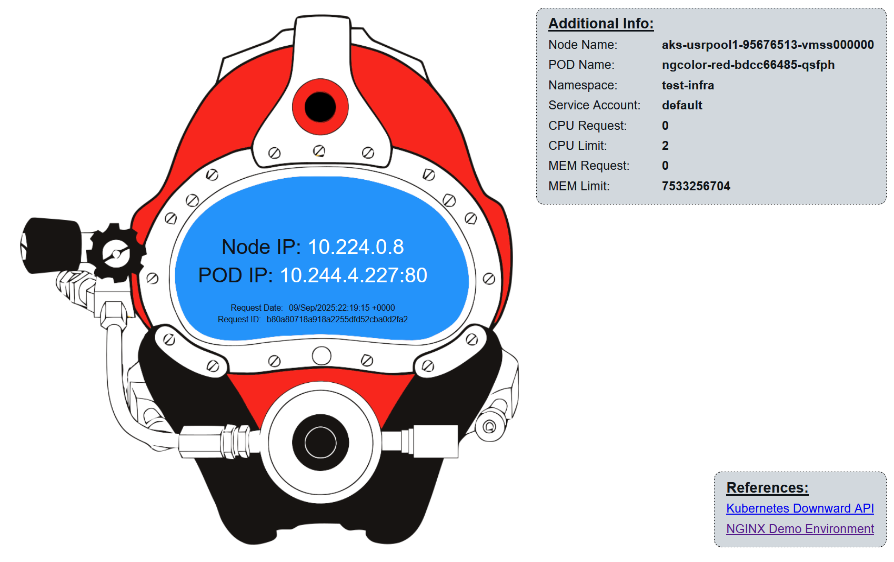

import Prerequisites from "../../src/components/SharedMarkdown/_prerequisites.mdx";
import ProvisionResourceGroup from "../../src/components/SharedMarkdown/_provision_resource_group.mdx";
import ProvisionAKSCluster from "../../src/components/SharedMarkdown/_provision_aks_cluster.mdx";
import Cleanup from "../../src/components/SharedMarkdown/_cleanup.mdx";

Application Gateway for Containers is an application layer (layer 7) load balancing and dynamic traffic management product for workloads running in a Kubernetes cluster. It extends Azure's Application Load Balancing portfolio and is a new offering under the Application Gateway product family. It enables multiple Layer 7 features:

- Traffic splitting / Weighted round robin

- Mutual authentication to the backend target

- Kubernetes support for Ingress and Gateway API

- Flexible deployment strategies

- Increased performance, offering near real-time updates to add or remove pods, routes, and probes

---

## Objectives

In this workshop, you will learn how to use Application Gateway for Containers with Azure Kubernetes Service (AKS). 

* Deploy and configure an ALB controller.

* Create an Application Gateway for Containers resource via CRDs (managed by the ALB Controller).

* Install and configure cert-manager to manage and assign certificates to your workloads exposed via Application Gateway for Containers.

* Expose an application to the Internet over HTTPS.

* Create a canary deployment by leveraging traffic splitting.

* Apply Web Application Firewall Policies to your HTTPRoutes.


---

<Prerequisites 
  tools={[
      {
        name: "Helm",
        url: "https://helm.sh/docs/intro/install/",
      }
  ]}
/>

Before starting with the deployment and configuration of the Application Gateway for Containers, you will need to register a few providers in the subscription which will contain the resources. You must also enable the extension "Application Gateway for Containers ALB Controller"

```bash
# Register required resource providers on Azure.
az provider register --namespace Microsoft.ContainerService
az provider register --namespace Microsoft.Network
az provider register --namespace Microsoft.NetworkFunction
az provider register --namespace Microsoft.ServiceNetworking

# Register preview features required for the ALB Controller AKS add-on.
az feature register --namespace Microsoft.ContainerService --name ApplicationLoadBalancerPreview
az feature register --namespace Microsoft.ContainerService --name ManagedGatewayAPIPreview
az provider register --namespace Microsoft.ContainerService

# Install Azure CLI extensions.
az extension add --name alb
az extension add --name aks-preview
```

## Expose an application over HTTP

### Install and configure the ALB Controller

The ALB Controller is a Kubernetes deployment that orchestrates configuration and deployment of Application Gateway for Containers. It uses both ARM and configuration APIs to propagate configuration to the Application Gateway for Containers Azure deployment. After installing it in a cluster, it will apply a set of CRDs to the cluster:

- ApplicationLoadBalancer
- BackendLoadBalancingPolicy
- BackendTLSPolicy
- FrontendTLSPolicy
- HealthCheckPolicy
- IngressExtension
- RoutePolicy
- WebApplicationFirewallPolicy

View the architecture of Application Gateway with Containers in the image below:


#### Enable the ALB Controller AKS Add-on

The simplest way to install the ALB controller is via the AKS add-on. The add-on automatically handles:

- Creating a managed identity (`applicationloadbalancer-<cluster-name>`) with the required role assignments (Reader, Network Contributor, AppGw for Containers Configuration Manager) scoped to the managed cluster resource group.
- Configuring a federated identity credential for workload identity.
- Creating a delegated subnet (`aks-appgateway`) in the cluster's virtual network.

Enable the add-on on your existing cluster:

```bash
az aks update --name ${AKS_NAME} --resource-group ${RG_NAME} --enable-gateway-api --enable-application-load-balancer
```

:::tip
For a new cluster, you can pass `--enable-gateway-api --enable-application-load-balancer` directly to `az aks create`.
:::

Verify the ALB Controller pods are running in the `kube-system` namespace:

```bash
kubectl get pods -n kube-system | grep alb-controller
```

You should see two `alb-controller` pods in `Running` state.

Verify GatewayClass `azure-alb-external` is installed on your cluster. You should see that the GatewayClass has a condition that reads `Valid` GatewayClass:

```bash
kubectl get gatewayclass azure-alb-external -o yaml
```

Now that you have successfully installed an ALB Controller on your cluster, you can provision the Application Gateway For Containers resources in Azure.

:::note
If you prefer a manual installation using Helm (for example, to customise the controller namespace or version), refer to the [Helm-based deployment guide](https://learn.microsoft.com/en-us/azure/application-gateway/for-containers/quickstart-deploy-application-gateway-for-containers-alb-controller-helm).
:::


### Provision a (managed) Application Gateway for Containers

In this deployment strategy, ALB Controller deployed in Kubernetes is responsible for the lifecycle of the Application Gateway for Containers resource and its sub resources. ALB Controller creates an Application Gateway for Containers resource when an ApplicationLoadBalancer custom resource is defined on the cluster. The service lifecycle is based on the lifecycle of the custom resource.


#### Retrieve the auto-provisioned subnet

The AKS add-on automatically created a delegated subnet named `aks-appgateway` in the cluster's virtual network. Retrieve its resource ID:

```bash
MC_RG_NAME=$(az aks show --resource-group ${RG_NAME} --name ${AKS_NAME} --query "nodeResourceGroup" -o tsv)
CLUSTER_SUBNET_ID=$(az vmss list --resource-group $MC_RG_NAME --query '[0].virtualMachineProfile.networkProfile.networkInterfaceConfigurations[0].ipConfigurations[0].subnet.id' -o tsv)
read -d '' VNET_NAME VNET_RG_NAME VNET_ID <<< $(az network vnet show --ids $CLUSTER_SUBNET_ID --query '[name, resourceGroup, id]' -o tsv)
ALB_SUBNET_ID=$(az network vnet subnet show --name aks-appgateway --resource-group $VNET_RG_NAME --vnet-name $VNET_NAME --query '[id]' --output tsv)
```

:::note
The add-on also assigned all the required permissions (Reader, Network Contributor, AppGw for Containers Configuration Manager) to the managed identity it created, so no manual role assignments are needed.
:::


#### Create an Application Load Balancer

When you create an ApplicationLoadBalancer (with API alb.networking.azure.io/v1), the ALB controller will create an Application Gateway for Containers resource in Azure. Let's first create a namespace:

```bash
kubectl create ns alb-test-infra
```

Now create an Application Load Balancer in the newly created namespace:

```yaml
kubectl apply -f -  <<EOF
apiVersion: alb.networking.azure.io/v1
kind: ApplicationLoadBalancer
metadata:
  name: alb-test
  namespace: alb-test-infra
spec:
  associations:
  - $ALB_SUBNET_ID
EOF
```

The ALB Controller deployed in Kubernetes is responsible for the lifecycle of the Application Gateway for Containers resource and its sub resources. ALB Controller creates the Application Gateway for Containers resource when an ApplicationLoadBalancer custom resource is defined on the cluster and its lifecycle is based on the lifecycle of the custom resource.


```bash
kubectl get applicationloadbalancer alb-test -n alb-test-infra -o yaml -w
```

You can now navigate to the Azure Portal, and visualize your managed Application Gateway for Containers:




### Create a Gateway with an HTTP listener

Every time a Gateway resource is created referencing the ApplicationLoadBalancer resource, ALB Controller provisions a new Frontend resource and manage its lifecycle based on the lifecycle of the Gateway resource.

```yaml
kubectl apply -f - <<EOF
apiVersion: gateway.networking.k8s.io/v1
kind: Gateway
metadata:
  name: gateway-01
  namespace: test-infra
  annotations:
    alb.networking.azure.io/alb-namespace: alb-test-infra
    alb.networking.azure.io/alb-name: alb-test
spec:
  gatewayClassName: azure-alb-external
  listeners:
  - name: http-listener
    protocol: HTTP
    port: 80
    allowedRoutes:
        namespaces:
          from: Same
EOF
```

### Deploy an example web server and expose it as HTTPRoute

Let's deploy an example nginx web server which we will first access via HTTP, and later on via HTTPS.

```yaml
kubectl apply -f - <<EOF
apiVersion: apps/v1
kind: Deployment
metadata:
  name: ngcolor-blue
  namespace: test-infra
spec:
  replicas: 1
  selector:
    matchLabels:
       target: ngcolor-blue
  template:
    metadata:
      name: ngcolor-blue
      labels:
        target: ngcolor-blue
    spec:
      nodeSelector:
        kubernetes.azure.com/mode: user
      containers:
      - name: nginxcolordemo
        image: scubakiz/nginxcolordemo:blue-1.0
        ports:
        - containerPort: 80
          protocol: TCP
        env:
        - name: NODE_IP
          valueFrom:
            fieldRef:
              fieldPath: status.hostIP
        - name: NODE_NAME
          valueFrom:
            fieldRef:
              fieldPath: spec.nodeName
        - name: POD_NAMESPACE
          valueFrom:
            fieldRef:
              fieldPath: metadata.namespace
        - name: POD_SERVICE_ACCOUNT
          valueFrom:
            fieldRef:
              fieldPath: spec.serviceAccountName 
        - name: POD_CPU_REQUEST
          valueFrom:
            resourceFieldRef:
              containerName: nginxcolordemo
              resource: requests.cpu
        - name: POD_CPU_LIMIT
          valueFrom:
            resourceFieldRef:
              containerName: nginxcolordemo
              resource: limits.cpu
        - name: POD_MEM_REQUEST
          valueFrom:
            resourceFieldRef:
              containerName: nginxcolordemo
              resource: requests.memory
        - name: POD_MEM_LIMIT
          valueFrom:
            resourceFieldRef:
              containerName: nginxcolordemo
              resource: limits.memory 
        imagePullPolicy: Always
---          
apiVersion: v1
kind: Service
metadata:
  name: ngcolor-blue
  namespace: test-infra
spec:
  ports:
    - port: 8080
      targetPort: 80
  selector:
    target: ngcolor-blue
  type: ClusterIP
EOF
```

We can now expose the application as HTTPRoute. First, get the address assign to the Gateway resource:

```bash
export MY_FRONTEND_ADDRESS=$(kubectl -n test-infra get gateway gateway-01 -o jsonpath='{.status.addresses[0].value}')
```

```yaml
kubectl apply -f - <<EOF
apiVersion: gateway.networking.k8s.io/v1
kind: HTTPRoute
metadata:
  name: ngcolor-app
  namespace: test-infra
spec:
  parentRefs:
  - name: gateway-01
  hostnames:
  - $MY_FRONTEND_ADDRESS
  rules:
  - matches:
    - path:
        type: PathPrefix
        value: /
    backendRefs:
    - name: ngcolor-blue
      port: 8080
EOF
```

For using a custom domain, you can also replace `<MY_FRONTEND_ADDRESS>` with `<MY_CUSTOM_FQDN>`, but you must be able to resolve the address, or to pass the "Host" http header. You can test the access to the application: 

```bash
curl http://<MY_FRONTEND_ADDRESS>

# if using a custom domain
curl http://<MY_CUSTOM_FQDN>
# or
curl http://<MY_FRONTEND_ADDRESS> -H "Host: <MY_CUSTOM_FQDN>"
```

Or open your browser and navigate to http://$MY_FRONTEND_ADDRESS:



## Expose an application over HTTPS

In the previous section you learnt how to expose your Kubernetes workloads through HTTP with Application Gateway for Containers. While the previous method allows you to access your applications, you are doing so in an insecure way. In order to secure your application traffic, it is necessary to expose it through HTTPS (which requires the use of SSL/TLS certificates).

### Install and configure Cert-Manager

[Cert-Manager](https://cert-manager.io/) is a powerful and extensible X.509 certificate controller for Kubernetes workloads, which obtains certificates from a variety of Issuers, both public or private, and ensure the certificates are valid and up-to-date. It will also attempt to renew certificates at a configured time before expiry. For the purposes of this lab, we have cert-manager configure certificates issued from Let's Encrypt to demonstrate an end-to-end deployment, where Application Gateway for Containers is providing TLS offloading. View architecture below:


In order to use it to manage certificates for our applications exposed through Application Gateway for Containers, we first need to install it with Helm:

```bash
helm repo add jetstack https://charts.jetstack.io --force-update
helm install \
  cert-manager jetstack/cert-manager \
  --namespace cert-manager \
  --create-namespace \
  --version v1.17.1 \
  --set config.enableGatewayAPI=true \
  --set crds.enabled=true
```

Create a `ClusterIssuer` resource to define how cert-manager will communicate with Let's Encrypt. For this example, an HTTP challenge is used. During challenge, cert-manager creates an `HTTPRoute` resource and corresponding pod presenting a validation endpoint to prove ownership of the domain.

```yaml
kubectl apply -f - <<EOF
apiVersion: cert-manager.io/v1
kind: ClusterIssuer
metadata:
  name: letsencrypt-prod
spec:
  acme:
    server: https://acme-v02.api.letsencrypt.org/directory # production endpoint
    email: your-email@example.com
    privateKeySecretRef:
      name: letsencrypt-private-key
    solvers:
      - http01:
          gatewayHTTPRoute:
            parentRefs:
              - name: gateway-01
                namespace: test-infra
                kind: Gateway
EOF
```

### Add an HTTPS listener to your existing Gateway

Modify the gateway to include a listener for HTTPS traffic:

```yaml
kubectl apply -f - <<EOF
apiVersion: gateway.networking.k8s.io/v1
kind: Gateway
metadata:
  name: gateway-01
  namespace: test-infra
  annotations:
    alb.networking.azure.io/alb-namespace: alb-test-infra
    alb.networking.azure.io/alb-name: alb-test
    cert-manager.io/issuer: letsencrypt-cert
spec:
  gatewayClassName: azure-alb-external
  listeners:
  - name: http-listener
    protocol: HTTP
    port: 80
    allowedRoutes:
        namespaces:
          from: Same
  - name: https-listener
    port: 443
    protocol: HTTPS
    tls:
      certificateRefs:
      - name: letsencrypt-secret
    allowedRoutes:
      namespaces:
        from: Same
EOF
```

You should now be able to access your application via HTTPS, without modifying the HTTPRoute:

```bash
curl https://$MY_FRONTEND_ADDRESS
```

## Implementing Canary deployments with Traffic Splitting

Canary deployments are a release strategy where a new version of software is gradually rolled out to a small subset of users before a full rollout. This approach minimizes risk by allowing teams to monitor performance and catch issues early. Application Gateway for Containers enables you to perform canary deployments thanks to its [traffic splitting feature](https://learn.microsoft.com/en-us/azure/application-gateway/for-containers/how-to-traffic-splitting-gateway-api?tabs=alb-managed). Traffic splitting is a technique which routes a portion of user traffic to the new version while the rest continues to use the stable one. This split can be adjusted dynamically; for example, starting with 5% of traffic and increasing as confidence grows. 

In previous steps, you deployed an application that displayed a blue scuba mask, as well as some information about the pod. Let's now deploy a "newer" version, in which the scuba mask is painted in red:

```yaml
kubectl apply -f - <<EOF
apiVersion: apps/v1
kind: Deployment
metadata:
  name: ngcolor-red
  namespace: test-infra
spec:
  replicas: 1
  selector:
    matchLabels:
       target: ngcolor-red
  template:
    metadata:
      name: ngcolor-red
      labels:
        target: ngcolor-red
    spec:
      nodeSelector:
        kubernetes.azure.com/mode: user
      containers:
      - name: nginxcolordemo
        image: scubakiz/nginxcolordemo:red-1.0
        ports:
        - containerPort: 80
          protocol: TCP
        env:
        - name: NODE_IP
          valueFrom:
            fieldRef:
              fieldPath: status.hostIP
        - name: NODE_NAME
          valueFrom:
            fieldRef:
              fieldPath: spec.nodeName
        - name: POD_NAMESPACE
          valueFrom:
            fieldRef:
              fieldPath: metadata.namespace
        - name: POD_SERVICE_ACCOUNT
          valueFrom:
            fieldRef:
              fieldPath: spec.serviceAccountName 
        - name: POD_CPU_REQUEST
          valueFrom:
            resourceFieldRef:
              containerName: nginxcolordemo
              resource: requests.cpu
        - name: POD_CPU_LIMIT
          valueFrom:
            resourceFieldRef:
              containerName: nginxcolordemo
              resource: limits.cpu
        - name: POD_MEM_REQUEST
          valueFrom:
            resourceFieldRef:
              containerName: nginxcolordemo
              resource: requests.memory
        - name: POD_MEM_LIMIT
          valueFrom:
            resourceFieldRef:
              containerName: nginxcolordemo
              resource: limits.memory 
        imagePullPolicy: Always
---          
apiVersion: v1
kind: Service
metadata:
  name: ngcolor-red
  namespace: test-infra
spec:
  ports:
    - port: 8080
      targetPort: 80
  selector:
    target: ngcolor-red
  type: ClusterIP
EOF
```

Let's now add the `ngcolor-red` service to the HTTPRoute, so that a percentage of requests get forwarded to that service instead. In the example below, 50% of requests will be sent to `ngcolor-blue` service, and the other 50% to `ngcolor-red`.

```yaml
kubectl apply -f - <<EOF
apiVersion: gateway.networking.k8s.io/v1
kind: HTTPRoute
metadata:
  name: ngcolor-app
  namespace: test-infra
spec:
  parentRefs:
  - name: gateway-01
  hostnames:
  - $MY_FRONTEND_ADDRESS
  rules:
  - backendRefs:
    - name: ngcolor-blue
      port: 8080
      weight: 50
    - name: ngcolor-red
      port: 8080
      weight: 50
EOF
```

Open your browser and navigate to https://$MY_FRONTEND_ADDRESS:


50% of the times you will be redirected to the `ngcolor-red` service instead:



You can play around with the weights to see how many more requests get sent to one service vs. the other one.

## Protect your application with a Web Application Firewall Policy

Azure Web Application Firewall on Azure Application Gateway for Containers provides comprehensive protection for your Kubernetes workloads against common web vulnerabilities and attacks. For example, it addresses SQL injection, cross-site scripting (XSS), and other Open Web Application Security Project (OWASP) top 10 threats.

Let's start by creating a WAF Policy, and get the ID for future use:

```bash
export WAF_POLICY_NAME=waf-akslabs-agwc

az network application-gateway waf-policy create \
  --name $WAF_POLICY_NAME \
  --resource-group $MC_RG_NAME \
  --location $LOCATION \
  --policy-settings state=Enabled mode=Prevention

export WAF_POLICY_ID=$(az network application-gateway waf-policy show -n ${WAF_POLICY_NAME} -g ${MC_RG_NAME} --query id -o tsv)
```

### Block traffic from your Public IP Address

Let's create an example policy:

```bash
export MY_PUBLIC_IP=$(curl ifconfig.me)

az network application-gateway waf-policy custom-rule create  \
  --resource-group $MC_RG_NAME \
  --policy-name $WAF_POLICY_NAME \
  --rule-type MatchRule \
  --name blockmyip \
  --action Block \
  --priority 50 \
  --match-conditions "[{"variables":[{"variableName":"RemoteAddr"}],"operator":"Equal","values":["$MY_PUBLIC_IP"]}]"
```

When assigned, this policy will block traffic originating from your Public IP address.

### Assign permissions to the managed identity

The ALB controller needs Network Contributor permissions on the WAF Policy to be able to join it to the HTTP route. Since the AKS add-on created the managed identity in the node resource group, retrieve its principal ID and assign the role:

```bash
PRINCIPAL_ID=$(az identity show -g $MC_RG_NAME -n "applicationloadbalancer-${AKS_NAME}" --query principalId -o tsv)
az role assignment create --assignee-object-id $PRINCIPAL_ID --assignee-principal-type ServicePrincipal --scope $WAF_POLICY_ID --role "4d97b98b-1d4f-4787-a291-c67834d212e7" # Network Contributor
```

### Assign the policy

You can assign the WAF Policy to the Gateway, so that all HTTPRoutes exposed through that Gateway will be protected by the policy.

```yaml
kubectl apply -f - <<EOF
apiVersion: alb.networking.azure.io/v1
kind: WebApplicationFirewallPolicy
metadata:
  name: sample-waf-policy
  namespace: test-infra
spec:
  targetRef:
    group: gateway.networking.k8s.io
    kind: Gateway
    name: gateway-01
    namespace: test-infra
  webApplicationFirewall: 
    id: $WAF_POLICY_ID
EOF
```

Alternatively, you can configure the `WebApplicationFirewallPolicy` to only apply to a specific `HTTPRoute`:

```yaml
kubectl apply -f - <<EOF
apiVersion: alb.networking.azure.io/v1
kind: WebApplicationFirewallPolicy
metadata:
  name: sample-waf-policy
  namespace: test-infra
spec:
  targetRef:
    group: gateway.networking.k8s.io
    kind: HTTPRoute
    name: ngcolor-app
    namespace: test-infra
  webApplicationFirewall: 
    id: $WAF_POLICY_ID
EOF
```

Given that we have previously exposed the application both through HTTP and HTTPs, let's now block HTTP traffic with a `WebApplicationFirewallPolicy`, without needing to remove the listener from the `HTTPRoute`. We do so by adding `sectionNames` matching the name of the listener configured in the `Gateway` resource:

```yaml
kubectl apply -f - <<EOF
apiVersion: alb.networking.azure.io/v1
kind: WebApplicationFirewallPolicy
metadata:
  name: sample-waf-policy
  namespace: test-infra
spec:
  targetRef:
    group: gateway.networking.k8s.io
    kind: Gateway
    name: gateway-01
    namespace: test-infra
    sectionNames: 
      - http-listener
  webApplicationFirewall: 
    id: $WAF_POLICY_ID
EOF
```

You can now test the access to the application:

```bash
curl http://$MY_FRONTEND_ADDRESS
```

Will return `Access Forbidden`. Meanwhile:

```bash
curl https://$MY_FRONTEND_ADDRESS
```

Will return something similar to the output below (mind that your Pod and Node IPs will differ):

```html
<!DOCTYPE html>
<html>
  <head>
    <title>Welcome to Color Demo</title>
    <link href="https://docs.nginx.com/_static/nginx-favicon.png" rel="icon" type="image/png">
    <link href="default.css" rel="stylesheet" type="text/css">
  </head>

  <body onload="Refresh();">
    <div class="container">
      
      <div class="centered info">
        <p ><span>Node IP:</span> <span><font >10.224.0.8</font></span></p>               

        <p ><span>POD IP:</span> <span><font >10.244.4.209:80</font></span></p>
        <div class="smaller"><span>Request Date:</span> <span>10/Sep/2025:17:46:32 +0000</span></div>
        <div class="smaller"><span>Request ID:</span> <span>b28542c5f70c9268809860d3a9eb1ae7</span></div>
      </div>
      <div class="top-right additional">
        <h3>Additional Info:</h3>
        <p ><span>Node Name: </span> <span><font >aks-usrpool1-95676513-vmss000000</font></span></p>
        <p ><span>POD Name: </span> <span><font >ngcolor-blue-7758b6fccb-v9hmb</font></span></p>
        <p ><span>Namespace: </span> <span><font >test-infra</font></span></p>
        <p ><span>Service Account: </span> <span><font >default</font></span></p>
        <p ><span>CPU Request: </span> <span><font >0</font></span></p>
        <p ><span>CPU Limit: </span> <span><font >2</font></span></p>
        <p ><span>MEM Request: </span> <span><font >0</font></span></p>
        <p ><span>MEM Limit: </span> <span><font >7533256704</font></span></p>
      </div>
Downward API</a></span></p>
        <p ><span><a target="_blank" href="https://docs.nginx.com/nginx/deployment-guides/setting-up-nginx-demo-environment/">NGINX Demo Environment</a></span></p>
      </div>
    </div>
  </body>
  <script type="text/javascript">
    function Refresh() {
                  setTimeout( function() { location.reload(true); }, 3000 );
          }
  </script>
</html>
```

---

## Authors

This lab was originally developed by Carlos Mestre del Pino. He can be reached at:

**LinkedIn:** [Carlos Mestre del Pino](https://www.linkedin.com/in/mestredelpino/) \
**BlueSky** [@mestredelpino.com](https://bsky.app/profile/mestredelpino.com) 

