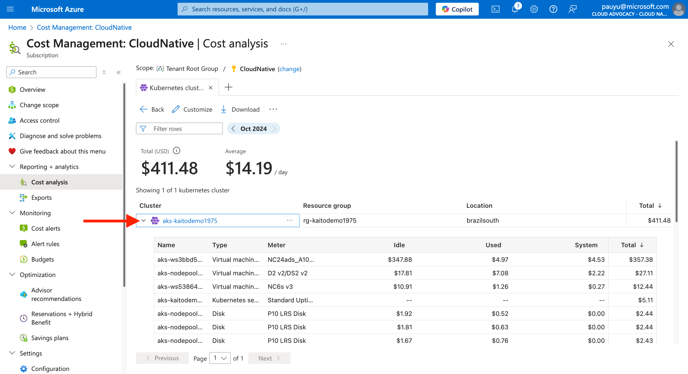
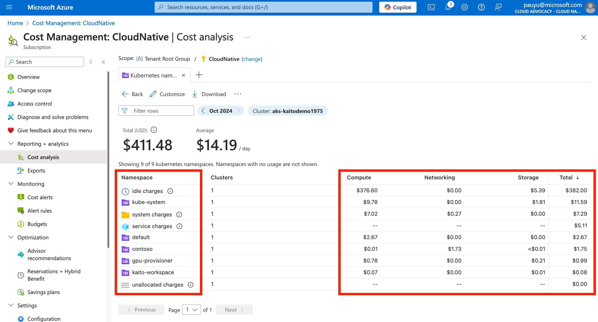

## Advanced Observability Concepts

Monitoring your AKS cluster has never been easier. Services like Azure Managed Prometheus and Azure Managed Grafana provide a fully managed monitoring solution for your AKS cluster all while using industry standard cloud-native tools. You can always deploy the open-source Prometheus and Grafana to your AKS cluster, but with Azure Managed Prometheus and Azure Managed Grafana, you can save time and resources by letting Azure manage the infrastructure for you.

The cluster should already be onboarded for monitoring; however, if you want to review the monitoring configuration, you can head over to the **Insights** under the **Monitoring** section in the Azure portal. From there, you can click on the **Monitor Settings** button and review/select the appropriate options. More information can be found [here](https://learn.microsoft.com/azure/azure-monitor/containers/kubernetes-monitoring-enable?tabs=cli#enable-full-monitoring-with-azure-portal).

### AKS control plane metrics

As you may know, Kubernetes control plane components are managed by Azure and there are metrics that Kubernetes administrators would like to monitor such as kube-apiserver, kube-scheduler, kube-controller-manager, and etcd. These are metrics that typically were not exposed to AKS users... until now. AKS now offers a preview feature that allows you to access these metrics and visualize them in Azure Managed Grafana. More on this preview feature can be found [here](https://learn.microsoft.com/azure/aks/monitor-aks#monitor-aks-control-plane-metrics-preview). Before you set off to enable this, it is important to consider the [pre-requisites and limitations](https://learn.microsoft.com/azure/aks/monitor-aks#prerequisites-and-limitations) of this feature while it is in preview.

To enable the feature simply run the following command to register the preview feature.

```bash
az feature register \
--namespace "Microsoft.ContainerService" \
--name "AzureMonitorMetricsControlPlanePreview"
```

Once the feature is registered, refresh resource provider.

```bash
az provider register --namespace Microsoft.ContainerService
```

After the feature is registered, you can enable the feature on your existing AKS cluster by running the following command. New clusters will have this feature enabled by default from this point forward.

```bash
az aks update \
--resource-group ${RG_NAME} \
--name ${AKS_NAME} \
```

<div class="info" data-title="Note">

> The AKS cluster must also have been onboarded to Azure Managed Prometheus in order for the data to be collected.

</div>

With Azure Managed Grafana integrated with Azure Managed Prometheus, you can import [kube-apiserver](https://grafana.com/grafana/dashboards/20331-kubernetes-api-server/) and [etcd](https://grafana.com/grafana/dashboards/20330-kubernetes-etcd/) metrics dashboards.

Before you attempt to import dashboards into the Azure Managed Grafana instance, you will need to make sure the Azure CLI extension for Azure Managed Grafana is installed. Run the following command to install the extension.

```bash
az extension add --name amg
```

Run the following command to import the kube-apiserver and etcd metrics dashboards.

```bash
# import kube-apiserver dashboard
az grafana dashboard import \
--name ${GRAFANA_NAME} \
--resource-group ${RG_NAME} \
--folder 'Azure Managed Prometheus' \
--definition 20331

# import etcd dashboard
az grafana dashboard import \
--name ${GRAFANA_NAME} \
--resource-group ${RG_NAME} \
--folder 'Azure Managed Prometheus' \
--definition 20330
```

Now you, should be able to browse to your Azure Managed Grafana instance and see the kube-apiserver and etcd metrics dashboards in the Azure Managed Prometheus folder.

Out of the box, only the etcd and kube-apiserver metrics data is being collected as part of the [minimal ingestion profile](https://learn.microsoft.com/azure/aks/monitor-aks-reference#minimal-ingestion-profile-for-control-plane-metrics-in-managed-prometheus) for control plane metrics. This profile is designed to provide a balance between the cost of monitoring and the value of the data collected. The others mentioned above will need to be manually enabled and this can be done by deploying a ConfigMap named [ama-metrics-settings-configmap](https://github.com/Azure/prometheus-collector/blob/89e865a73601c0798410016e9beb323f1ecba335/otelcollector/configmaps/ama-metrics-settings-configmap.yaml) in the kube-system namespace.

<div class="info" data-title="Note">

> More on the minimal ingestion profile can be found [here](https://learn.microsoft.com/azure/azure-monitor/containers/prometheus-metrics-scrape-configuration-minimal).

</div>

Run the following command to deploy the **ama-metrics-settings-configmap** in the **kube-system** namespace.

```bash
kubectl apply -f https://raw.githubusercontent.com/Azure/prometheus-collector/89e865a73601c0798410016e9beb323f1ecba335/otelcollector/configmaps/ama-metrics-settings-configmap.yaml
```

Now, you can edit the **ama-metrics-settings-configmap** to enable the metrics you want to collect. Run the following command to edit the **ama-metrics-settings-configmap**.

```bash
kubectl edit cm ama-metrics-settings-configmap -n kube-system
```

Toggle any of the metrics you wish to collect to **true**, but keep in mind that the more metrics you collect, the more resources you will consume.

<div class="info" data-title="Note">

> The Azure team does not offer a [pre-built dashboard](https://grafana.com/orgs/azure/dashboards) for some of these metrics, but you can reference the doc on [supported metrics for Azure Managed Prometheus](https://learn.microsoft.com/azure/aks/monitor-aks-reference#supported-metrics-for-microsoftcontainerservicemanagedclusters) and create your own dashboards in Azure Managed Grafana or search for community dashboards on [Grafana.com](https://grafana.com/grafana/dashboards) and import them into Azure Managed Grafana. Just be sure to use the Azure Managed Prometheus data source.

</div>

### Custom scrape jobs for Azure Managed Prometheus

Typically when you want to scrape metrics from a target, you would create a scrape job in Prometheus. With Azure Managed Prometheus, you can create custom scrape jobs for your AKS cluster using the PodMonitor and ServiceMonitor custom resource definitions (CRDs) that is automatically created when you onboard your AKS cluster to Azure Managed Prometheus. These CRDs are nearly identical to the open-source Prometheus CRDs, with the only difference being the apiVersion. When you deploy a PodMonitor or ServiceMonitor for Azure Managed Prometheus, you will need to specify the apiVersion as **azmonitoring.coreos.com/v1** instead of **monitoring.coreos.com/v1**.

We'll go through a quick example of how to deploy a PodMonitor for a reference app that is deployed to your AKS cluster.

Run the following command to deploy a reference app to the cluster to generate some metrics.

```bash
kubectl apply -f https://raw.githubusercontent.com/Azure/prometheus-collector/refs/heads/main/internal/referenceapp/prometheus-reference-app.yaml
```

Run the following command to deploy a PodMonitor for the reference app

```bash
kubectl apply -f https://raw.githubusercontent.com/Azure/prometheus-collector/refs/heads/main/otelcollector/deploy/example-custom-resources/pod-monitor/pod-monitor-reference-app.yaml
```

Custom resource targets are scraped by pods that start with the name **ama-metrics-\*** and the Prometheus Agent web user interface is available on port 9090. So we can port-forward the Prometheus pod to our local machine to access the Prometheus UI and explore all that is configured.

Run the following command to get the name of the Azure Monitor Agent pod.

```bash
AMA_METRICS_POD_NAME="$(kubectl get po -n kube-system -lrsName=ama-metrics -o jsonpath='{.items[0].metadata.name}')"
```

Run the following command to port-forward the Prometheus pod to your local machine.

```bash
kubectl port-forward ${AMA_METRICS_POD_NAME} -n kube-system 9090
```

Open a browser and navigate to http://localhost:9090 to access the Prometheus UI.

If you click on the **Status** dropdown and select **Targets**, you will see the target for **podMonitor/default/prometheus-reference-app-job/0** and the endpoint that is being scraped.

If you click on the **Status** dropdown and select **Service Discovery**, you will see the scrape jobs with active targets and discovered labels for **podMonitor/default/prometheus-reference-app-job/0**.

When you are done, you can stop the port-forwarding by pressing **Ctrl+c**.

Give the scrape job a few moments to collect metrics from the reference app. Once you have given it enough time, you can head over to Azure Managed Grafana and click on the **Explore** tab to query the metrics that are being collected.

More on custom scrape jobs can be found [here](https://learn.microsoft.com/azure/azure-monitor/containers/prometheus-metrics-scrape-crd) and [here](https://learn.microsoft.com/azure/azure-monitor/containers/prometheus-metrics-troubleshoot#prometheus-interface)

### AKS Cost Analysis

Cost for AKS clusters can be managed like any other resource in Azure, via the [Azure Cost Analysis](https://portal.azure.com/#view/Microsoft_Azure_CostManagement/Menu/~/overview/openedBy/AzurePortal) blade.

Using the Cost Analysis blade, you can view the cost of your Azure resources overtime and can be scoped by management group, subscription, and resource group with further filters and views for more granular analysis. To learn more about Azure Cost Analysis, see [the quickstart guide](https://learn.microsoft.com/azure/cost-management-billing/costs/quick-acm-cost-analysis).

When it comes to Kubernetes, you would want to see a more granular view of the compute, networking, and storage costs associated with Kubernetes namespaces. This is where the AKS Cost Analysis add-on comes in. The AKS Cost Analysis add-on is built on the [OpenCost](https://www.opencost.io/) project, with is a CNCF incubating project that provides a Kubernetes-native cost analysis solution.

You can always install the open-source project into your AKS cluster by following these [instructions](https://www.opencost.io/docs/configuration/azure) but it might be easiest to enable the AKS Cost Analysis add-on to your AKS cluster.

There are a few pre-requisites to enable the AKS Cost Analysis add-on to your AKS cluster and they are documented [here](https://learn.microsoft.com/azure/aks/cost-analysis#prerequisites-and-limitations). Once you have met the pre-requisites, you can enable the AKS Cost Analysis add-on to your AKS cluster.

Run the following command to enable the AKS Cost Analysis add-on to your AKS cluster.

```bash
az aks update \
--resource-group ${RG_NAME} \
--name ${AKS_NAME} \
--enable-cost-analysis
```

It can take a few minutes to enable the AKS Cost Analysis add-on to your AKS cluster and up to 24 hours for cost data to be populated up to the Cost Analysis blade. But when it is ready, you can view the cost of your AKS cluster and its namespaces by navigating to the [Azure Cost Analysis](https://portal.azure.com/#view/Microsoft_Azure_CostManagement/Menu/~/overview/openedBy/AzurePortal) blade. Once you scope to a management group, subscription, or resource group that contains your AKS cluster, you should see a button labeled "Kubernetes clusters". Clicking on this button will take you to the AKS Cost Analysis blade where you can view the cost of your AKS cluster and its namespaces.


If you expand the AKS cluster, you will see a list of all the Azure resources that are associated with it.



If you click on the AKS cluster, you will see a list of all compute, networking, and storage costs associated with namespaces in the AKS cluster.



It also shows you the "idle charges" which is a great way to see if you are over-provisioning your AKS cluster or if you any opportunities to optimize your AKS cluster.

---
