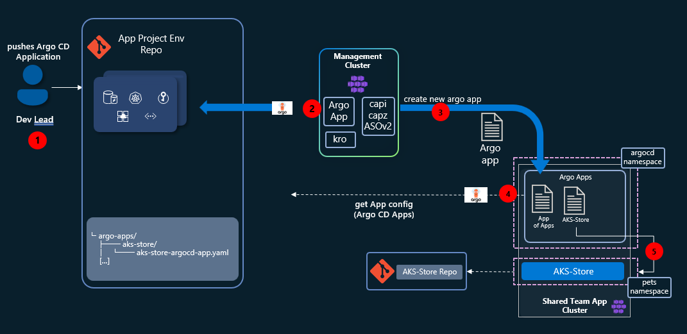
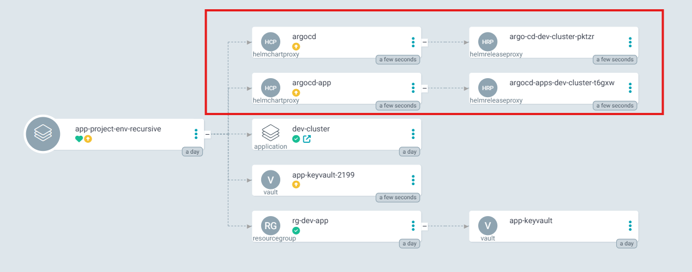
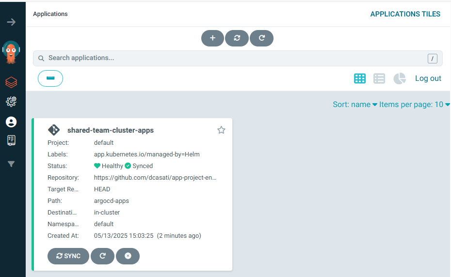

# Build a GitOps-Driven Platform on AKS with the App of Apps Pattern

This hands-on lab builds on the previous module, [Platform Engineering on AKS with GitOps, CAPZ, and ASO](./aks-capz-aso.md), where you learned:

* Key tools and foundational concepts in platform engineering
* How to build a control plane AKS cluster using Azure CLI
* How to use CAPZ and ASO to provision infrastructure and Kubernetes clusters

In this module, you'll take those concepts further by implementing a modern, production-grade platform engineering environment on Azure Kubernetes Service (AKS). You'll use **GitOps** to manage both infrastructure and application lifecycles declaratively via Argo CD, enabling a fully automated and auditable workflow.

---

## Objectives

* Bootstrap GitOps with Argo CD using the App of Apps pattern and ApplicationSets
* Deploy application environments across both existing and newly provisioned AKS clusters

---

## Core Concepts

### App of Apps Pattern

The **App of Apps** pattern in Argo CD is critical for scalable platform operations. It allows you to declaratively manage complex environments using a *parent application* that orchestrates multiple *child applications*, each responsible for a specific platform or workload layer.

**Why adopt this pattern?**

* Centralizes control without creating monolithic repositories
* Enables modular, reusable GitOps pipelines with clear environment boundaries
* Simplifies team onboarding and environment provisioning
* Improves governance and consistency across clusters
* Enforces a clean separation of concerns between platform and application teams

### GitOps Bridge

The [**GitOps Bridge**](https://github.com/gitops-bridge-dev/gitops-bridge?tab=readme-ov-file) is a design pattern that links **infrastructure provisioning** (e.g., AKS clusters via CAPZ or ASO) with **application delivery workflows** (e.g., Argo CD).

It ensures that once infrastructure is provisioned, GitOps agents like Argo CD are automatically bootstrapped and begin synchronizing workloads from Git repositories.

**Benefits:**

* Automates the transition from infrastructure to workload readiness
* Establishes Git as the single source of truth for Day-1 and Day-2 operations
* Enables repeatable, scalable platform rollouts

---

## Prerequisites

This lab builds on the [Platform Engineering lab using AKS, GitOps, CAPZ, and ASOv2](./aks-capz-aso.md). Before proceeding:

1. Complete that module.
2. Load the required environment variables:

```bash
source .envrc
```

---
## Management Cluster Add-Ons

Next, we will create an **Argo CD Cluster Secret** that defines how Argo CD interacts with the `Management Cluster` (the control plane cluster you’ve bootstrapped on the [Platform Engineering on AKS with GitOps, CAPZ, and ASO](./aks-capz-aso.md) lab). It also provides metadata and flags used by **ApplicationSets** and **GitOps automation controllers** to selectively deploy platform add-ons.

The bootstrapping process leverages the [**Building a Platform Engineering Environment on Azure Kubernetes Service (AKS)** repository](https://github.com/Azure-Samples/aks-platform-engineering#).

* This repository provides pre-defined GitOps configurations and Argo CD Applications.
* Specifically, Argo CD is configured to install applications from the `gitops/bootstrap/control-plane/addons` directory in this repository, automating the installation of core platform components such as Argo CD itself, Kargo, and others.

### Key Purposes of the Argo CD Cluster Secret

1. **Registers the Management Cluster with Argo CD**

   * `argocd.argoproj.io/secret-type: cluster` tells Argo CD that this secret defines a Kubernetes cluster connection.
   * Even though this is the *in-cluster* connection (`server: https://kubernetes.default.svc`), explicitly registering it allows Argo CD to associate metadata and configuration with the cluster.

2. **Bootstraps the Management Cluster with Platform Add-Ons**

   * The `enable_*` labels act as deployment toggles, controlling which platform components Argo CD should deploy to this cluster.

   * Examples:

     * `enable_kargo: "true"` → Argo CD will deploy Kargo (used for container image promotions).
     * `enable_cert_manager: "false"` → Argo CD will skip deploying cert-manager.
     * `enable_argocd: "true"` → Ensures Argo CD’s own management components remain installed.

3. **Allows ApplicationSets to Filter and Target Clusters Dynamically**

   * These labels and annotations are used by Argo CD’s `ApplicationSet` generators to dynamically select which clusters receive specific add-ons.

    Example:

      ```yaml
      generators:
        - clusters:
            selector:
              matchLabels:
                enable_kargo: "true"
      ```

     This ensures only clusters that explicitly enable Kargo will have it deployed.

4. **Why Bootstrap the Management Cluster?**

   * The Management Cluster acts as the **central control plane** for your platform:

     * Hosts Argo CD and GitOps automation tooling.
     * Manages cluster lifecycle using CAPZ.
     * Manages Azure resources via ASOv2.
   * Bootstrapping ensures that essential platform engineering tools are deployed **before** any workload or development clusters are created.
   * This cluster remains focused on **platform operations**, while other clusters are dedicated to running application workloads.

---

### Summary

| Field                 | Purpose                                                   |
| --------------------- | --------------------------------------------------------- |
| `enable_argocd`       | Deploy or manage Argo CD components                       |
| `enable_cert_manager` | Deploy cert-manager if `true`                             |
| `enable_kargo`        | Deploy Kargo for GitOps promotions                        |
| `environment`         | Labels the environment type (e.g., control-plane)         |
| Annotations           | Used by ApplicationSets for repository and path targeting |

This makes the entire GitOps process **dynamic and declarative**. By adjusting these flags, you can control what each cluster receives—without modifying the underlying ApplicationSet definitions. Bootstrap automation, repository structure, and Argo CD ApplicationSets work together to provide a scalable and repeatable platform delivery model.

The following applications will be installed to the cluster:

| Application Name                       | Purpose                                                           |
| -------------------------------------- | ----------------------------------------------------------------- |
| `cluster-addons`                       | Deploys shared platform components (e.g., networking, monitoring) |
| `addon-aks-labs-gitops-argo-cd`        | Installs and manages Argo CD                                      |
| `addon-aks-labs-gitops-argo-events`    | Installs Argo Events for webhook/schedule-based automation        |
| `addon-aks-labs-gitops-argo-rollouts`  | Installs progressive delivery tools like canary/blue-green        |
| `addon-aks-labs-gitops-argo-workflows` | Installs CI/CD pipelines via Argo Workflows                       |
| `addon-aks-labs-gitops-cert-manager`   | Installs cert-manager for TLS cert automation                     |
| `addon-aks-labs-gitops-kargo`          | Installs Kargo for image promotion workflows                      |

:::info
Since we have already installed `cert-manager` on the [Platform Engineering on AKS with GitOps, CAPZ, and ASO](./aks-capz-aso.md) lab, we will skip that installation here by changing the `enable_cert_manager` to `false`
:::

### Configure Environment Variables

Lets start by creating some environment variables that will be used in the Argo CD secret:

```bash
cat <<EOF > .envrc
export GITOPS_ADDONS_ORG="https://github.com/Azure-Samples"
export GITOPS_ADDONS_REPO="aks-platform-engineering"
export GITOPS_ADDONS_BASEPATH="gitops/"
export GITOPS_ADDONS_PATH="bootstrap/control-plane/addons"
export GITOPS_ADDONS_REVISION="main"
EOF
```

**Variable reference:**

| Variable                 | Description                                          |
| ------------------------ | ---------------------------------------------------- |
| `GITOPS_ADDONS_ORG`      | GitHub user/org URL                                  |
| `GITOPS_ADDONS_REPO`     | Repository name                                      |
| `GITOPS_ADDONS_BASEPATH` | Base directory in the repo for GitOps content        |
| `GITOPS_ADDONS_PATH`     | Full path to add-ons directory                       |
| `GITOPS_ADDONS_REVISION` | Git branch or revision to sync (e.g., `main`, `dev`) |

---

## Bootstrapping the Add-Ons

### Step 1: Create the Argo CD Cluster Secret

```bash
cat <<EOF > aks-labs-gitops.yaml
apiVersion: v1
kind: Secret
metadata:
  name: aks-labs-gitops
  namespace: argocd
  labels:
    argocd.argoproj.io/secret-type: cluster
    akuity.io/argo-cd-cluster-name: ${AKS_CLUSTER_NAME}
    enable_argocd: "true"
    enable_cert_manager: "false"
    enable_kargo: "true"
    environment: control-plane
  annotations:
    addons_repo_url: "${GITOPS_ADDONS_ORG}/${GITOPS_ADDONS_REPO}"
    addons_repo_basepath: "${GITOPS_ADDONS_BASEPATH}"
    addons_repo_path: "${GITOPS_ADDONS_PATH}"
    addons_repo_revision: "${GITOPS_ADDONS_REVISION}"
    cluster_name: ${AKS_CLUSTER_NAME}
    infrastructure_provider: capz
    akspe_identity_id: "${AZURE_CLIENT_ID}"
    tenant_id: "${AZURE_TENANT_ID}"
    subscription_id: "${AZURE_SUBSCRIPTION_ID}"
type: Opaque
stringData:
  name: aks-labs-gitops
  server: https://kubernetes.default.svc
  config: |
    {
      "tlsClientConfig": {
        "insecure": false
      }
    }
EOF
```

```bash
kubectl apply -f aks-labs-gitops.yaml
```

### Step 2: Apply the ApplicationSet to Bootstrap Add-Ons

```bash
cat <<EOF > bootstrap-addons.yaml
apiVersion: argoproj.io/v1alpha1
kind: ApplicationSet
metadata:
  name: cluster-addons
  namespace: argocd
spec:
  syncPolicy:
    preserveResourcesOnDeletion: true
  generators:
    - clusters:
        selector:
          matchExpressions:
            - key: akuity.io/argo-cd-cluster-name
              operator: NotIn
              values: [in-cluster]
  template:
    metadata:
      name: cluster-addons
    spec:
      project: default
      source:
        repoURL: '{{metadata.annotations.addons_repo_url}}'
        path: '{{metadata.annotations.addons_repo_basepath}}{{metadata.annotations.addons_repo_path}}'
        targetRevision: '{{metadata.annotations.addons_repo_revision}}'
        directory:
          recurse: true
          exclude: exclude/*
      destination:
        namespace: argocd
        name: '{{name}}'
      syncPolicy:
        automated: {}
EOF
```

```bash
kubectl apply -f bootstrap-addons.yaml
```

You can now connect to the Argo CD instance in the `Management Cluster` and verify that the new apps were added:

1. Retrieve the Argo CD UI secret

```bash
kubectl get secrets argocd-initial-admin-secret -n argocd --template="{{index .data.password | base64decode}}" ; echo
```

2. Create the port forward to the Argo CD service

```bash
kubectl port-forward svc/argocd-server -n argocd 8080:443
```

3. Open your browser at: [https://localhost:8080/](https://localhost:8080/)


This implements the **App of Apps** pattern by using a parent (an _Argo CD ApplicationSet_) to dynamically generate and manage multiple _child Argo CD Applications_ based on cluster metadata. The parent application references the Git repository and controls which add-ons are installed by reading labels and annotations defined in this secret. 

This creates a modular, scalable, and declarative way to manage both platform and workload environments through GitOps.

---

### Sample 1: Expanding our AKS Cluster with the App of Apps Pattern

Now that we have seen how to deploy a cluster using the App of Apps pattern, lets try a more complex scenario. In this example, you’ll create a new resource, the HelmProxyChart, that will be attached to the cluster created earlier on [Platform Engineering on AKS with GitOps, CAPZ, and ASO](./aks-capz-aso.md) lab.

Using your GitHub repo created on the [Platform Engineering on AKS with GitOps, CAPZ, and ASO](./aks-capz-aso.md#setting-up-your-dev-environment) lab, lets expand our Sample-1 AKS Cluster. We will also create a new Application and deploy that to our dev cluster.

At the end, you will have built this:



:::important
Before you proceed, verify that you are running these commands from your local GitHub repo. If you have started this lab at the `$HOME` directory of your user, that should be at `~/aks-labs/app-project-env`. If not, look at where you have cloned the `app-project-env` directory.
::::

#### Adding the HelmChartProxy and AKS Store Application

1. Create the `HelmChartProxy`:

```bash
cat <<EOF> samples/sample-1/argo-helmchartproxy.yaml
apiVersion: addons.cluster.x-k8s.io/v1alpha1
kind: HelmChartProxy
metadata:
  name: argocd
  namespace: default
spec:
  clusterSelector:
    matchLabels: {}
  repoURL: https://argoproj.github.io/argo-helm
  chartName: argo-cd
  options:
    waitForJobs: true
    wait: true
    timeout: 5m
    install:
      createNamespace: true
---
apiVersion: addons.cluster.x-k8s.io/v1alpha1
kind: HelmChartProxy
metadata:
  name: argocd-app
  namespace: default
spec:
  clusterSelector:
    matchLabels: {}
  repoURL: https://argoproj.github.io/argo-helm
  chartName: argocd-apps
  options:
    waitForJobs: true
    wait: true
    timeout: 5m
    install:
      createNamespace: true
  valuesTemplate: |
    applications:
      shared-team-cluster-apps:
        namespace: argocd
        finalizers:
          - resources-finalizer.argocd.argoproj.io
        project: default
        sources:
          - repoURL: https://github.com/${GITHUB_USERNAME}/app-project-env.git
            path: argocd-apps
            targetRevision: HEAD
            directory:
              recurse: true
        destination:
          server: https://kubernetes.default.svc
          namespace: default
        syncPolicy:
          automated:
            prune: false
            selfHeal: false
          syncOptions:
            - CreateNamespace=true
        revisionHistoryLimit: 2
        ignoreDifferences:
          - group: apps
            kind: Deployment
            jsonPointers:
              - /spec/replicas
        info:
          - name: url
            value: https://argoproj.github.io/
EOF
```
2. Create the an ArgoCD Application directory:

```bash
mkdir -p argocd-apps/aks-store
```

3. Create the an ArgoCD Application to be deployed to our Dev cluster:

```bash
cat <<EOF> argocd-apps/aks-store/aks-store-argocd-app.yaml
apiVersion: argoproj.io/v1alpha1
kind: Application
metadata:
  name: aks-store-demo
  namespace: default
spec:
  project: default
  source:
    repoURL: https://github.com/Azure-Samples/aks-store-demo.git
    targetRevision: HEAD
    path: kustomize/overlays/dev
  destination:
    server: https://kubernetes.default.svc
    namespace: argocd
  syncPolicy:
    automated: {}
EOF
```

4. Commit the files to GitHub

```bash
git add .
git commit -m 'Sample-1: Expanding our AKS Cluster with the App of Apps Pattern'
```

Expect:

```bash
[main 5b8f70c] Sample-1: Expanding our AKS Cluster with the App of Apps Pattern
 4 files changed, 110 insertions(+)
 create mode 100644 argocd-apps/aks-store/aks-store-argocd-app.yaml
 create mode 100644 github-app-project-argo-cd-app.yaml
 create mode 100644 rg-dev-app-aso-credentials.yaml
 create mode 100644 samples/sample-1/argo-helmchartproxy.yaml
```

5. Push them to GitHub

```bash
git push
```

Expect:

```bash
Enumerating objects: 13, done.
Counting objects: 100% (13/13), done.
Delta compression using up to 12 threads
Compressing objects: 100% (9/9), done.
Writing objects: 100% (10/10), 1.96 KiB | 501.00 KiB/s, done.
Total 10 (delta 0), reused 0 (delta 0), pack-reused 0
To github.com:dcasati/app-project-env.git
   3adefb8..5b8f70c  main -> main
```
In the `Management Cluster`, you should now see the new `HelmChartProxy` objects. The `HelmChartProxy` will deploy `Argo CD` _and_ the `AKS-Store` demo directly to the `Dev Cluster`:



Now, assuming the role of the Dev Lead, you should be able to connect to the Dev Cluster and see the new application deployed to that cluster:

1. Get the credentials for the Dev Cluster:

```bash
az aks get-credentials -n ${DEV_CLUSTER_NAME} -g ${DEV_CLUSTER_NAME}
```

2. Retrieve the Argo CD UI secret

```bash
kubectl get secrets argocd-initial-admin-secret -n argocd --template="{{index .data.password | base64decode}}" ; echo
```

3. Create the port forward to the Argo CD service

```bash
kubectl port-forward svc/argocd-server -n argocd 18080:443
```

4. Open your browser at: https://localhost:18080/



And the new Application, the AKS Store, deployed:


You can now access the AKS Store. 

1. Retrieve the LoadBalancer IP for the AKS Store

```bash
kubectl get svc -n pets store-front
```

2. Open your browser and navigate to the public IP of the store:


## Next Steps

If you’re familiar with Infrastructure as Code tools like **Terraform**, explore how you can streamline your Azure resource management by converting existing resources into ASO manifests using the [`asoctl`](https://azure.github.io/azure-service-operator/tools/) tool.

* [Learn more about `asoctl` here](https://azure.github.io/azure-service-operator/tools/)
* [Download `asoctl` directly from GitHub](https://github.com/Azure/azure-service-operator/releases/tag/v2.13.0)

To learn how to extend your platform engineering capabilities even further by using **Kube Resource Orchestrator (kro)** for advanced resource composition and automation take a look at the [Expanding the platform capabilities with Kube Resource Orchestrator (kro)](./using-kro.md) lab.

---

## Summary

In this module, you:

* Applied the App of Apps and GitOps Bridge patterns for scalable platform operations
* Bootstrapped a GitOps management plane using Argo CD and ApplicationSets
* Provisioned AKS clusters declaratively with CAPZ
* Deployed workloads to managed clusters via GitOps