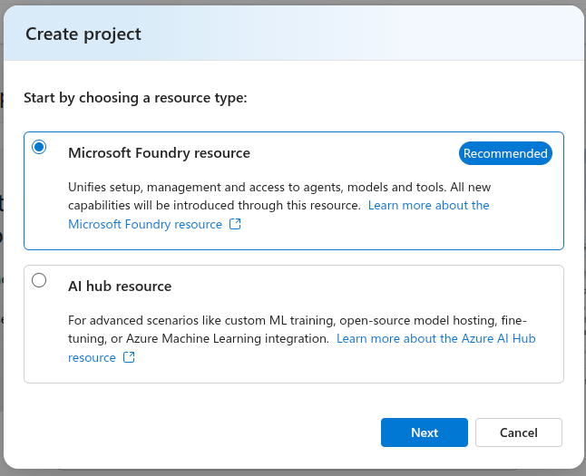
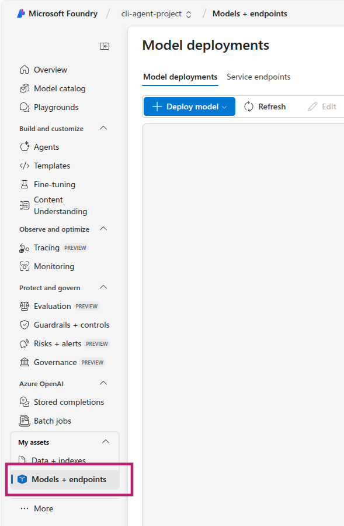
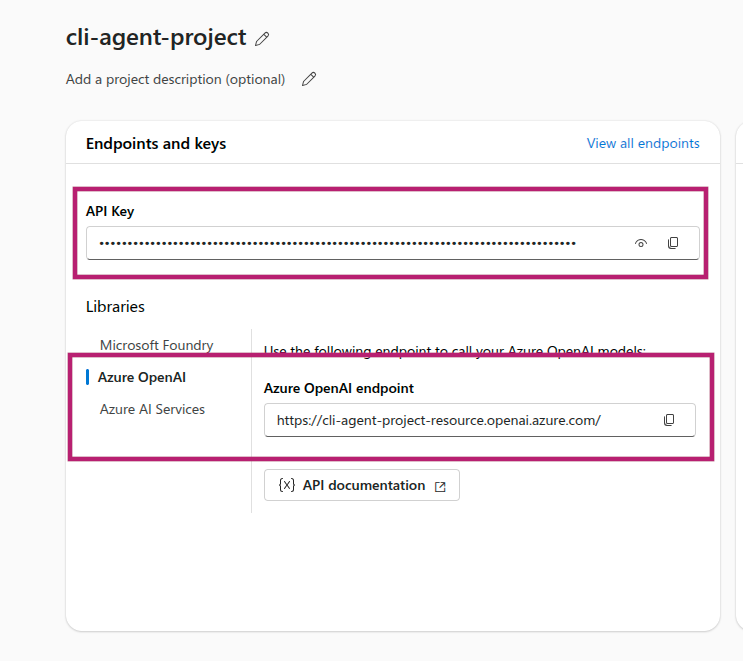

import Tabs from '@theme/Tabs';
import TabItem from '@theme/TabItem';

In this workshop, you'll learn how to leverage AI agents to troubleshoot Azure Kubernetes Service (AKS) clusters using the [AKS-MCP Server](https://github.com/Azure/aks-mcp). By the end of this hands-on lab, you'll be able to configure the AKS MCP Server with AI agents and use natural language to debug AKS infrastructure—including clusters, nodes, and networks—as well as Kubernetes workloads and applications.

---

## Objectives

By completing this workshop, you will be able to:

- Configure the AKS MCP Server with different AI agents:
    - [Agentic CLI for AKS](https://learn.microsoft.com/en-us/azure/aks/cli-agent-for-aks-overview)
    - [GitHub Copilot CLI](https://github.com/features/copilot/cli)
- Use the [AKS-MCP Server](https://github.com/Azure/aks-mcp) to understand AKS infrastructure and troubleshoot clusters.
- Use the [AKS-MCP Server](https://github.com/Azure/aks-mcp) to troubleshoot Kubernetes workloads and applications.

---

## Background Concepts

Before diving into the hands-on exercises, let's understand the key technologies that make AI-powered Kubernetes troubleshooting possible.

### What is AKS-MCP Server?

The [AKS-MCP Server](https://github.com/Azure/aks-mcp) is a **Model Context Protocol (MCP) server** that enables AI assistants to interact with Azure Kubernetes Service (AKS) clusters. It serves as a bridge between AI tools (like GitHub Copilot, Claude, and other MCP-compatible AI assistants) and AKS, translating natural language requests into AKS operations and returning results in a format AI tools can understand.

### Key Capabilities

| Capability | Description |
|------------|-------------|
| **Cluster Discovery** | Automatically discover and connect to AKS clusters in your subscription |
| **Resource Inspection** | Query pods, services, deployments, and other Kubernetes resources |
| **Real-time Observability** | Leverage [Inspektor Gadget](https://inspektor-gadget.io/) for live tracing of network traffic, DNS queries, and system calls |
| **Azure Integration** | Access Azure-specific resources like NSGs, load balancers, and managed identities |
| **Troubleshooting** | Diagnose connectivity issues, misconfigurations, and performance problems |

### How It Works

```
┌─────────────────┐     ┌─────────────────┐     ┌─────────────────┐
│   AI Assistant  │────▶│  AKS-MCP Server │────▶│   AKS Cluster   │
│ (Copilot/Claude)│◀────│   (Bridge)      │◀────│   & Azure APIs  │
└─────────────────┘     └─────────────────┘     └─────────────────┘
```

The MCP server exposes a standardized interface that AI assistants use to:
1. **Discover** available tools and capabilities
2. **Execute** operations against your AKS clusters
3. **Return** structured results for AI interpretation

### What is an AI Agent?

AI agents go beyond traditional chat-based assistance by **actively reasoning** about problems, **taking actions**, and **using tools** to achieve goals autonomously.

### Chat vs Agent: Key Differences

| Aspect | Traditional Chat | AI Agent |
|--------|------------------|----------|
| **Interaction** | Single question → single answer | Multi-step problem solving |
| **Actions** | Suggests commands to run | Executes commands directly |
| **Context** | Limited to conversation | Pulls live data from external systems |
| **Workflow** | Manual iteration | Autonomous task completion |

### Why AI Agents for Kubernetes?

Kubernetes troubleshooting often requires:
- Checking multiple resources across namespaces
- Correlating logs, events, and metrics
- Understanding complex service dependencies
- Analyzing network policies and connectivity

AI agents excel at this by:
- **Planning** a systematic investigation approach
- **Gathering** context from multiple sources (kubectl, Azure APIs, observability tools)
- **Analyzing** findings to identify root causes
- **Recommending** or executing fixes

In this workshop, you'll use AI agents with the AKS-MCP Server to troubleshoot real issues by exploring configurations, logs, and live system state—all through natural language prompts.

## Prerequisites

Before you begin, ensure you have the following prerequisites in place:

### Environment Variables

Throughout this workshop, we'll use the following environment variables. Set them up once at the beginning:

```bash
# Azure configuration
export LOCATION=eastus
export RG_NAME=aks-mcp-rg
export CLUSTER_NAME=aks-mcp-cluster
export MI_NAME=aks-mcp-identity

# Kubernetes configuration
export NAMESPACE=aks-agent
export SERVICE_ACCOUNT=aks-mcp-sa
```

:::tip
You can customize these values as needed, but make sure to update them consistently throughout the workshop.
:::

### Setting up Azure CLI

1. Install the [Azure CLI](https://learn.microsoft.com/en-us/cli/azure/install-azure-cli) on your machine.
2. Verify the installation by running:
   ```bash
   az --version
   ```

### Logging in

1. Open your terminal or command prompt.
2. Run the following command to log in to your Azure account:
   ```bash
   az login --use-device-code
   ```
3. Use the link provided in the output to authenticate with your Azure account.
4. Once authenticated, you'll see your subscription details in the terminal.

### Setting up a Resource Group

1. Create a resource group to host your AKS cluster:
   ```bash
   az group create --name $RG_NAME --location $LOCATION
   ```

### Setting up an AKS Cluster

1. Create an AKS cluster:
   ```bash
    az aks create \
    --name $CLUSTER_NAME \
    --resource-group $RG_NAME \
    --location $LOCATION \
    --node-count 2 \
    --enable-oidc-issuer \
    --enable-workload-identity \
    --network-plugin azure \
    --ssh-access disabled
   ```

2. Verify the cluster was created successfully:
   ```bash
   az aks show --resource-group $RG_NAME --name $CLUSTER_NAME -o table
   ```

3. Get the cluster credentials to interact with your cluster:
   ```bash
   # Get credentials
   az aks get-credentials --resource-group $RG_NAME --name $CLUSTER_NAME

   # Set the current context to the newly created cluster
   kubectl config use-context $CLUSTER_NAME
   ```

4. Verify connectivity to your cluster:
   ```bash
   kubectl cluster-info
   ```

5. Setup Azure Managed Identity and Kubernetes Service Account:
    :::note
    You can skip these steps if you don't plan to deploy AKS-MCP Server in the cluster e.g . using Client mode with Agentic CLI for AKS or GitHub Copilot CLI.
    :::

    ```bash
    # Create Azure Managed Identity
    az identity create --resource-group $RG_NAME --name $MI_NAME --location $LOCATION

    # Get the client ID of the Azure Managed Identity
    CLIENT_ID=$(az identity show --resource-group $RG_NAME --name $MI_NAME --query "clientId" --output tsv)

    # Get principal ID of the Azure Managed Identity
    PRINCIPAL_ID=$(az identity show --resource-group $RG_NAME --name $MI_NAME --query "principalId" --output tsv)

    # Get subscription ID
    SUBSCRIPTION_ID=$(az account show --query "id" --output tsv)

    # Assign Azure RBAC role to the Azure Managed Identity
    # Grant Contributor role at subscription level
    az role assignment create \
        --role "Contributor" \
        --assignee-object-id $PRINCIPAL_ID \
        --assignee-principal-type ServicePrincipal \
        --scope "/subscriptions/$SUBSCRIPTION_ID"

    # Get the OIDC issuer URL
    OIDC_ISSUER=$(az aks show --resource-group $RG_NAME --name $CLUSTER_NAME --query "oidcIssuerProfile.issuerUrl" --output tsv)

    # Create the federated credential
    az identity federated-credential create \
    --name "aks-mcp-federated-credential" \
    --identity-name $MI_NAME \
    --resource-group $RG_NAME \
    --issuer $OIDC_ISSUER \
    --subject "system:serviceaccount:${NAMESPACE}:${SERVICE_ACCOUNT}" \
    --audience api://AzureADTokenExchange

    # Create Kubernetes namespace
    kubectl create namespace $NAMESPACE

    # Create and prepare service account
    kubectl create serviceaccount -n $NAMESPACE $SERVICE_ACCOUNT
    kubectl annotate serviceaccount -n $NAMESPACE $SERVICE_ACCOUNT azure.workload.identity/client-id=$CLIENT_ID

    # Create cluster role binding
    kubectl create clusterrolebinding aks-mcp-sa-binding \
      --clusterrole=cluster-admin \
      --serviceaccount=$NAMESPACE:$SERVICE_ACCOUNT
    ```

### Setting up sample applications

To demonstrate the capabilities of the AKS-MCP Server, we'll deploy the [AKS Store demo](https://github.com/Azure-Samples/aks-store-demo) application—a sample e-commerce app with multiple microservices that's perfect for troubleshooting scenarios.

1. Create a namespace for the application:
    ```bash
    kubectl create namespace pets
    ```

2. Deploy the application:
    ```bash
    kubectl apply -f https://raw.githubusercontent.com/Azure-Samples/aks-store-demo/refs/heads/main/aks-store-quickstart.yaml -n pets
    ```

3. Wait for all pods to be ready:
    ```bash
    kubectl wait --for=condition=ready pod --all -n pets --timeout=180s
    ```

4. Get the external IP of the store front service:
    ```bash
    FRONTEND_IP=$(kubectl get svc -n pets store-front -o jsonpath='{.status.loadBalancer.ingress[0].ip}')
   ```

5. Verify the application is accessible:
    ```bash
    curl http://$FRONTEND_IP
    ```

## Setting up the AKS-MCP Server and AI Agent

With your AKS cluster and sample application ready, it's time to configure the AKS-MCP Server with an AI agent. The following section walks you through the setup process—feel free to select the agent that best suits your workflow.

<Tabs groupId="agents">
    <TabItem value="cli" label="Agentic CLI for AKS">
        The Agentic CLI for AKS supports AKS-MCP out of the box, so we only need to install the extension and configure the LLM connection.

        #### Step 1: Installing AKS extension

        Install/update the `aks-agent` extension using the following commands:

        ```bash
        # Install the extension
        az extension add --name aks-agent

        # Update the extension
        az extension update --name aks-agent
        ```

        :::tip
        If you run into issues installing or updating the extension, you can append `--debug` to these commands to collect detailed troubleshooting output.
        :::

        #### Step 2: Verifying the extension installation

        Verify that the extension is installed by running:

        ```bash
        az extension list
        ```
        Your output should include an entry for `aks-agent`.

        #### Step 3: Setting up the LLM

        To use the CLI agent, we need to configure an LLM backend. Start by heading to [Microsoft Foundry](https://ai.azure.com/) and creating a new project.

        :::note
        See [Microsoft documentation](https://learn.microsoft.com/en-us/azure/ai-foundry/openai/how-to/create-resource?pivots=web-portal) for more details.
        :::

        Choose the **"Microsoft Foundry resource"** as the resource type:

        

        Set **"cli-agent-project"** as the project name and select your subscription, resource group, and region:

        

        Wait for the project to be created:

        

        Next, we want to deploy a model. Select **"Models + endpoint"** from the left navigation pane:

        

        Look for the model you want to deploy (e.g., gpt-4.1) and click **"Confirm"**:

        

        :::tip
        We recommend using latest model e.g Claude Opus 4.5, Claude Sonnet 4.5, GPT 5.2 to get the best results
        :::

        Feel free to customize the deployment settings and press **"Deploy"**:

        

        Finally, make a note of **API endpoint** and **API key**:

        

        #### Step 4: Initializing the Agentic CLI for AKS

        Run the following command to initialize the Agentic CLI for AKS:

        ```bash
        az aks agent-init -g $RG_NAME -n $CLUSTER_NAME
        ```

        It will start by asking you about the mode you want to use. Select `1` for Cluster mode:

        ```bash
        🚀 Welcome to AKS Agent initialization!

        Please select the mode you want to use:
        1. Cluster mode - Deploys agent as a pod in your AKS cluster
        Uses service account and workload identity for secure access to cluster and Azure resources
        2. Client mode - Runs agent locally using Docker
        Uses your local Azure credentials and cluster user credentials for access

        Enter your choice (1 or 2): 1
        ```

        :::note
        You can also use **Client mode** to run the Agentic CLI locally if you don't want to deploy it as a pod in your cluster.
        :::

        Next, you will be asked about the namespace where the agent will be deployed. Select `aks-agent` as the namespace:

        ```bash
        Please specify the namespace where the agent will be deployed.

        Enter namespace (e.g., 'kube-system'): aks-agent
        ```

        Then you will need to provide the following LLM configuration details. Use **"Azure OpenAI"** (option 1) as the LLM provider and enter the API endpoint and API key from step 3:

        ```bash
        Please provide your LLM configuration. Type '/exit' to exit.
        1. Azure OpenAI
        2. OpenAI
        3. Anthropic
        4. Gemini
        5. OpenAI Compatible
        6. For other providers, see https://aka.ms/aks/agentic-cli/init
        Please choose the LLM provider (1-5): 1
        You selected provider: Azure OpenAI
        Enter value for deployment_name:  (Hint: ensure your deployment name is the same as the model name, e.g., gpt-5) gpt-4.1
        Enter value for api_key:
        Enter value for api_base:
        Enter value for api_version:
        ```

        Next, you will be asked to provide the service account name **"aks-mcp-sa"** created earlier in the Prerequisites section:

        ```bash
        👤 Service Account Configuration
        The AKS agent requires a service account with appropriate permissions in the 'aks-agent' namespace.
        Please ensure you have created the necessary Role and RoleBinding in your namespace for this service account.

        Enter service account name: aks-mcp-sa
        ✅ Using service account: aks-mcp-sa
        ```

        Finally, you will be asked about the managed identity configuration. Please enter `Y` to configure managed identity client ID:

        :::note
        You can use `az identity show --resource-group $RG_NAME --name $MI_NAME --query "clientId" --output tsv` to get the managed identity client ID.
        :::

        ```bash

        🔑 Managed Identity Configuration
        To access Azure resources using workload identity, you need to provide the managed identity client ID.
        Do you want to configure managed identity client ID? (Y/n): Y
        ✅ Using managed identity client ID: <managed-identity-client-id-guid>
        ```

        After providing all the required information, the AKS agent will be initialized and deployed in your cluster:

        ```
        🚀 Deploying AKS agent (this typically takes less than 2 minutes)...
        ✅ AKS agent deployed successfully!
        Verifying deployment status...
        ✅ AKS agent is ready and running!

        🎉 Initialization completed successfully!
        ```

        One last step is to enable `inspektorgadget` in AKS Agent to perform real-time observability. Run the following command to enable it:

        ```bash
        # Get helm chart version
        CHART_VERSION=$(helm get metadata aks-agent -n $NAMESPACE -o json | jq -r .version)

        # Enable Inspektor Gadget
        helm upgrade aks-agent oci://mcr.microsoft.com/aks/aks-agent-chart/aks-agent:$CHART_VERSION \
            -n $NAMESPACE --reuse-values \
            --set  'mcpAddons.aks.config.enabledComponents={az_cli,network,compute,kubectl,inspektorgadget}'

        # Install Inspektor Gadget
        IG_VERSION=$(curl -s https://api.github.com/repos/inspektor-gadget/inspektor-gadget/releases/latest | jq -r '.tag_name' | sed 's/^v//')
        helm install gadget --namespace=gadget --create-namespace oci://ghcr.io/inspektor-gadget/inspektor-gadget/charts/gadget --version=$IG_VERSION
        ```
    </TabItem>
    <TabItem value="copilot" label="GitHub Copilot CLI">
        GitHub Copilot CLI can be configured to use the AKS-MCP Server for enhanced Kubernetes troubleshooting capabilities.

        #### Step 1: Installing GitHub Copilot CLI

        Use the following command to install GitHub Copilot CLI:

        ```bash
        # Install GitHub Copilot CLI
        curl -fsSL https://gh.io/copilot-install | bash
        ```

        Please refer to [GitHub Copilot CLI installation guide](https://docs.github.com/en/copilot/how-tos/set-up/install-copilot-cli) for more details.

        #### Step 2: Configuring the AKS-MCP Server

        Before configuring GitHub Copilot CLI to use AKS-MCP Server, we need to install and download the AKS-MCP Server binary:

        ```bash
        # Prepare the environment
        # Note: Please adjust the OS and ARCH variables based on your environment
        VERSION=$(curl -s https://api.github.com/repos/Azure/aks-mcp/releases/latest | jq -r '.tag_name')
        OS=linux
        ARCH=amd64

        # Download the binary
        curl -L https://github.com/Azure/aks-mcp/releases/download/$VERSION/aks-mcp-$OS-$ARCH -o aks-mcp

        # Make the binary executable
        chmod +x aks-mcp

        # Move the binary to /usr/local/bin
        sudo mv aks-mcp /usr/local/bin/
        ```

        and configure the AKS-MCP Server by starting a copilot session and use `/mcp add` command to add the AKS-MCP Server:

        

        add the values as shown and hit `Ctrl+S` to save the changes:

        
    </TabItem>
</Tabs>

## Understanding AKS infrastructure and Kubernetes workloads

Now that the AKS-MCP Server and AI agent are configured, let's explore how to use them to understand your AKS infrastructure and Kubernetes workloads through natural language prompts.

<Tabs groupId="agents">
    <TabItem value="cli" label="Agentic CLI for AKS">
        Start an interactive session with the Agentic CLI for AKS:
        ```bash
        az aks agent -g $RG_NAME -n $CLUSTER_NAME --namespace $NAMESPACE
        ```

        You should see the following output:

        ```bash
        Loaded models: ['azure/gpt-4.1']
        Refreshing available datasources (toolsets)
        ✅ Toolset core_investigation
        ✅ Toolset internet
        ✅ Toolset runbook
        ✅ Toolset aks_api
        Toolset statuses are cached to /root/.aks-agent/toolsets_status.json
        ✅ Toolset core_investigation
        ✅ Toolset internet
        ✅ Toolset runbook
        ✅ Toolset aks_api
        NO ENABLED LOGGING TOOLSET
        Using model: azure/gpt-4.1 (1,047,576 total tokens, 32,768 output tokens)
        This tool uses AI to generate responses and may not always be accurate.
        Welcome to AKS AGENT: Type '/exit' to exit, '/help' for commands, '/feedback' to share your thoughts.
        User:
        ```

        ### Understanding Kubernetes Workloads

        With the agent running, you can now use natural language prompts to explore your cluster. Let's start by asking the agent for an overview of the infrastructure and applications:

        #### Prompt:

        ```bash
        Can you help me understand all the applications and AKS infrastructure for 'aks-mcp-cluster' running in 'aks-mcp-rg'?
        ```

        :::tip
        You can increase tokens per minute (**TPM**) in Microsoft Foundry if the agent has to wait between tool calls.
        :::

        The agent will come up with a plan to gather the required information and provide you with a detailed response about the AKS infrastructure and workloads running in the cluster:

        #### Plan:

        ```bash
        Task List:
        +----+------------------------------------------------------------------------------------------------+-----------------+
        | ID | Content                                                                                        | Status          |
        +----+------------------------------------------------------------------------------------------------+-----------------+
        | 1  | List all AKS cluster infrastructure components for 'aks-mcp-cluster' in 'aks-mcp-rg'.          | [~] in_progress |
        | 2  | List all applications running in 'aks-mcp-cluster'.                                            | [~] in_progress |
        | 3  | Verify findings and ensure all aspects of cluster infrastructure and applications are covered. | [ ] pending     |
        +----+------------------------------------------------------------------------------------------------+-----------------+
        ```

        After the agent finishes gathering the information, it comes back with the final response:

        #### Response:

        

        The agent supports follow-up questions, allowing you to dig deeper into specific areas. For example, try asking for more details about the `pets` namespace:

        #### Prompt:

        ```bash
        Can you provide more details about the applications running in 'pets' namespace?
        ```

        #### Response:

        


        ### AKS infrastructure

        Beyond Kubernetes workloads, the agent can also help you understand Azure-level infrastructure components. Let's explore some examples by asking about NSG rules and available upgrades:

        #### Prompt

        ```bash
        Can you check if there is a special rule for external IP in NSG?
        ```

        #### Response:

        

        You can also check for available cluster upgrades:

        #### Prompt:

        ```bash
        Can you tell me if there is newer Kubernetes version available?
        ```

        #### Response:

        

        ### Real-time Observability

        Beyond querying static configurations, we can also get deeper insights about our applications using real-time observability built into AKS-MCP. Let's go through some examples:

        #### Prompt:

        ```bash
        Can you give me overview of network traffic in my cluster?
        ```

        ```
        Task List:
        +----+----------------------------------------------------------------------------+-----------------+
        | ID | Content                                                                    | Status          |
        +----+----------------------------------------------------------------------------+-----------------+
        | 1  | Check available tools for network traffic and observability in the cluster | [~] in_progress |
        | 2  | Gather summary of network traffic using available observability tools      | [ ] pending     |
        | 3  | Summarize findings and provide network traffic overview                    | [ ] pending     |
        +----+----------------------------------------------------------------------------+-----------------+
        ```

        :::note
        The agent needs [Inspektor Gadget](https://github.com/inspektor-gadget/inspektor-gadget) to be installed in the cluster to provide real-time observability.
        AKS-MCP will automatically install Inspektor Gadget if it is not already installed. It might require your confirmation before proceeding or you can be
        more explicit by asking the agent to install it for you. For example: "Can you install Inspektor Gadget for me? Feel free to rerun with confirmation if needed."
        :::

        #### Response:

        

        You can also drill down into specific pods for a more detailed analysis. Try examining the system calls made by a particular service:

        #### Prompt:

        ```bash
        Can you give me detailed overview of order-service pod by examining the system calls?
        ```

        ```
        Task List:
        +----+---------------------------------------------------------+-----------------+
        | ID | Content                                                 | Status          |
        +----+---------------------------------------------------------+-----------------+
        | 1  | Find the pod name for order-service in 'pets' namespace | [~] in_progress |
        | 2  | Run system call observability on order-service pod      | [ ] pending     |
        | 3  | Summarize system call activity for order-service pod    | [ ] pending     |
        +----+---------------------------------------------------------+-----------------+
        ```

        #### Response:

        

    </TabItem>
    <TabItem value="copilot" label="GitHub Copilot CLI">
        Start an interactive session with GitHub Copilot CLI:

        ```bash
        copilot --allow-tool 'aks-mcp'
        ```

        ### Understanding Kubernetes Workloads

        With GitHub Copilot CLI running, you can use natural language prompts to explore your cluster. Let's start by asking for an overview of the infrastructure and applications:

        #### Prompt:

        ```bash
        Can you help me understand all the applications and AKS infrastructure for 'aks-mcp-cluster' running in 'aks-mcp-rg'?
        ```

        #### Response:

        

        

        The agent supports follow-up questions, allowing you to dig deeper into specific areas:

        #### Prompt:

        ```bash
        Can you provide more details about the applications running in 'pets' namespace?
        ```

        #### Response:

        

        ### AKS infrastructure

        Beyond Kubernetes workloads, you can also explore Azure-level infrastructure components:

        #### Prompt:

        ```bash
        Can you check if there is a special rule for external IP in NSG?
        ```

        :::note
        If you start a new session copilot might ask you to provide information about subscription, resource group, and cluster name.
        :::

        #### Response:

        

        You can also check for available cluster upgrades:

        #### Prompt:

        ```bash
        Can you tell me if there is newer AKS version available?
        ```

        #### Response:

        

        ### Real-time Observability

        Let's explore real-time observability capabilities:

        #### Prompt:

        ```bash
        Can you give me overview of real-time network traffic in my cluster?
        ```

        #### Response:

        

        You can also drill down into specific pods:

        #### Prompt:

        ```bash
        Can you give me detailed overview of order-service pod by examining the system calls?
        ```

        #### Response:

        It comes back with a detailed analysis with part of response:

        

    </TabItem>
</Tabs>

## Troubleshooting AKS infrastructure and clusters

Now that we've explored the agent's capabilities for understanding your cluster, let's put them to the test with a real troubleshooting scenario. We'll simulate a common infrastructure issue by adding an NSG rule that blocks HTTP traffic to our application.

First, get the managed resource group name and NSG name:

```bash
MANAGED_RG_NAME=$(az aks show --resource-group $RG_NAME --name $CLUSTER_NAME --query nodeResourceGroup -o tsv)
NSG_NAME=$(az network nsg list -g $MANAGED_RG_NAME --query "[0].name" -o tsv)
```

Next, add a deny rule with the highest priority to block incoming HTTP traffic to the frontend IP:

```bash
az network nsg rule create \
  --name block-external-ip --nsg-name $NSG_NAME \
  --priority 100 --resource-group $MANAGED_RG_NAME \
  --access deny --direction inbound \
  --protocol Tcp --source-address-prefixes Internet \
  --source-port-ranges '*' --destination-address-prefixes $FRONTEND_IP \
  --destination-port-ranges 80
```

Once the rule is added, accessing the external IP will result in a timeout:

```bash
curl --connect-timeout 5 http://$FRONTEND_IP
```

```console
curl: (28) Failed to connect to 4.245.135.2 port 80 after 5002 ms: Timeout was reached
```

<Tabs groupId="agents">
    <TabItem value="cli" label="Agentic CLI for AKS">
        Now let's use the AI agent to troubleshoot the connectivity issue we just created. Start an interactive session with the Agentic CLI for AKS if you haven't already:

        ```bash
        az aks agent -g $RG_NAME -n $CLUSTER_NAME --namespace $NAMESPACE
        ```

        #### Prompt:

        ```bash
        I'm unable to access my application running in 'pets' namespace on 'aks-mcp-cluster' in 'aks-mcp-rg'. The external IP is timing out. Can you help me troubleshoot this issue?
        ```

        The agent will analyze the situation and come up with a troubleshooting plan:

        #### Plan:

        ```bash
        Task List:
        +----+-----------------------------------------------------------------------------------------------+-----------------+
        | ID | Content                                                                                       | Status          |
        +----+-----------------------------------------------------------------------------------------------+-----------------+
        | 1  | Check AKS cluster health and context for 'aks-mcp-cluster' in 'aks-mcp-rg'.                   | [~] in_progress |
        | 2  | Identify application service(s) in 'pets' namespace and check their external IPs and status.  | [ ] pending     |
        | 3  | Check network resources (load balancer, NSG, subnet) for issues related to external access.   | [ ] pending     |
        | 4  | Check application pod status and events in 'pets' namespace for runtime or scheduling issues. | [ ] pending     |
        | 5  | Final review and verification of findings.                                                    | [ ] pending     |
        +----+-----------------------------------------------------------------------------------------------+-----------------+
        ```

        #### Response:

        

        The agent should identify the NSG rule blocking traffic. Let's ask it to help us fix the issue:

        #### Prompt:

        ```bash
        Can you help me remove the blocking rule to restore connectivity?
        ```

        #### Response:

        

        After performing the steps provided by the agent, you should be able to access the application again:

        :::note
        You can also use `az` CLI to delete the NSG rule using the following command:
        ```bash
        az network nsg rule delete --nsg-name $NSG_NAME --resource-group $MANAGED_RG_NAME --name block-external-ip
        ```
        :::

        ```bash
        curl http://$FRONTEND_IP
        ```

        :::tip
        The AI agent can help identify and troubleshoot various infrastructure issues including:
        - NSG rules blocking traffic
        - DNS resolution problems
        - Load balancer misconfigurations
        - Node-level networking issues
        :::

    </TabItem>
    <TabItem value="copilot" label="GitHub Copilot CLI">
        Now let's use GitHub Copilot CLI to troubleshoot the connectivity issue. Start an interactive session if you haven't already:

        ```bash
        copilot --allow-tool 'aks-mcp'
        ```

        #### Prompt:

        ```bash
        I'm unable to access my application running in 'pets' namespace on 'aks-mcp-cluster' in 'aks-mcp-rg'. The external IP is timing out. Can you help me troubleshoot this issue?
        ```

        #### Response:

        

        The agent should identify the NSG rule blocking traffic. We can ask if it can fix the issue:

        #### Response:

        

        After performing the steps provided by the agent, you should be able to access the application again:

        ```bash
        curl http://$FRONTEND_IP
        ```

        :::tip
        The AI agent can help identify and troubleshoot various infrastructure issues including:
        - NSG rules blocking traffic
        - DNS resolution problems
        - Load balancer misconfigurations
        - Node-level networking issues
        :::

    </TabItem>
</Tabs>

## Troubleshooting Kubernetes workloads and applications

Having successfully diagnosed an infrastructure-level issue, let's now shift focus to application-layer problems. To simulate a common misconfiguration, we'll change the target port for the `order-service` to an incorrect value.

First, let's break the `order-service` by changing its service target port:

```bash
kubectl patch service order-service -n pets --type='json' -p='[{"op": "replace", "path": "/spec/ports/0/targetPort", "value": 9999}]'
```

This will cause the service to forward traffic to port 9999 instead of the correct port 3000, breaking connectivity to the order service.

Verify the misconfiguration is in place by sending a request that will fail:

```bash
curl -X POST http://$FRONTEND_IP/api/orders \
     -H "Content-Type: application/json" \
     -d '{"customerId":"3798750450","items":[{"productId":2,"quantity":1,"price":6.99}]}'
```

You should see an nginx error indicating the service is unavailable:

```
<!DOCTYPE html>
<html>
<head>
<title>Error</title>
<style>
html { color-scheme: light dark; }
body { width: 35em; margin: 0 auto;
font-family: Tahoma, Verdana, Arial, sans-serif; }
</style>
</head>
<body>
<h1>An error occurred.</h1>
<p>Sorry, the page you are looking for is currently unavailable.<br/>
Please try again later.</p>
<p>If you are the system administrator of this resource then you should check
the error log for details.</p>
<p><em>Faithfully yours, nginx.</em></p>
</body>
</html>
```
<Tabs groupId="agents">
    <TabItem value="cli" label="Agentic CLI for AKS">
        Now let's use the AI agent to troubleshoot the application issue. Start an interactive session with the Agentic CLI for AKS if you haven't already:

        ```bash
        az aks agent -g $RG_NAME -n $CLUSTER_NAME --namespace $NAMESPACE
        ```

        #### Prompt:

        ```bash
        I'm experiencing issues with the order-service in the 'pets' namespace on 'aks-mcp-cluster' in 'aks-mcp-rg'. When I try to POST to the /api/orders endpoint, I get an nginx error page saying "the page you are looking for is currently unavailable". The store-front service seems to be running fine, but it cannot communicate with order-service. Can you help me diagnose what's wrong with the service connectivity?
        ```

        The agent will analyze the situation and come up with a troubleshooting plan:

        #### Plan:

        ```bash
        Task List:
        +----+------------------------------------------------------------------------------------------------+-----------------+
        | ID | Content                                                                                        | Status          |
        +----+------------------------------------------------------------------------------------------------+-----------------+
        | 1  | Check the order-service pod status and logs in 'pets' namespace.                              | [~] in_progress |
        | 2  | Verify the order-service service configuration and endpoints.                                 | [ ] pending     |
        | 3  | Test connectivity to the order-service from other pods.                                       | [ ] pending     |
        | 4  | Analyze findings and provide recommendations to fix the connectivity issue.                   | [ ] pending     |
        +----+------------------------------------------------------------------------------------------------+-----------------+
        ```

        #### Response:

        The agent should identify the incorrect target port configuration.

        

        After performing the steps provided by the agent, verify that the service is working correctly:

        :::note
        You can also manually fix the target port using kubectl:
        ```bash
        kubectl patch service order-service -n pets --type='json' -p='[{{"op": "replace", "path": "/spec/ports/0/targetPort", "value": 3000}}]'
        ```
        :::

        Finally, you can also use the agent to monitor for DNS resolution issues in the cluster. Try asking the agent to help with DNS monitoring:

        #### Prompt:

        ```bash
        Can you help me observe DNS resolution issues in real-time for 30 seconds? I'm seeing slow DNS requests or errors.
        ```

        #### Response:

        
    </TabItem>
    <TabItem value="copilot" label="GitHub Copilot CLI">
        Now let's use GitHub Copilot CLI to troubleshoot the application issue. Start an interactive session if you haven't already:

        ```bash
        copilot --allow-tool 'aks-mcp'
        ```

        #### Prompt:

        ```bash
        I'm experiencing issues with the order-service in the 'pets' namespace on 'aks-mcp-cluster' in 'aks-mcp-rg'. When I try to POST to the /api/orders endpoint, I get an nginx error page saying "the page you are looking for is currently unavailable". The store-front service seems to be running fine, but it cannot communicate with order-service. Can you help me diagnose what's wrong with the service connectivity?
        ```

        #### Response:

        

        The agent should identify the incorrect target port configuration.

        After performing the steps provided by the agent, verify that the service is working correctly.

        Finally, you can also use the agent to monitor for DNS resolution issues in the cluster:

        #### Prompt:

        ```bash
        Can you help me observe DNS resolution issues in real-time for 30 seconds? I'm seeing slow DNS requests or errors.
        ```

        #### Response:

        
    </TabItem>
</Tabs>

## Summary

Congratulations! You've completed this workshop and learned how the AKS-MCP Server serves as a powerful building block for AI-powered Kubernetes operations. Throughout this lab, you:

- **Configured AI agents** (Agentic CLI for AKS, GitHub Copilot CLI) with the AKS-MCP Server
- **Troubleshot AKS infrastructure** including NSG rules, networking, and cluster configurations
- **Debugged Kubernetes workloads** by identifying service misconfigurations and connectivity issues
- **Leveraged real-time observability** using Inspektor Gadget for deeper insights into pod behavior and network traffic

This workshop only scratched the surface of what's possible with AI-powered Kubernetes management. We encourage you to continue exploring the [AKS-MCP Server](https://github.com/Azure/aks-mcp) capabilities and integrate them into your own operational workflows!

### Cleanup

To avoid incurring unnecessary charges, remember to delete your resources when you're done:

```bash
az group delete --name $RG_NAME --yes --no-wait
```

### Additional Resources

- [AKS-MCP Server](https://github.com/Azure/aks-mcp)
- [Agentic CLI for AKS](https://learn.microsoft.com/en-us/azure/aks/agentic-cli-for-aks-overview)
- [GitHub Copilot CLI](https://docs.github.com/en/copilot/using-github-copilot/using-github-copilot-in-the-command-line)
- [Leveraging Real-Time insights via the AKS-MCP Server](https://blog.aks.azure.com/2025/08/20/real-time-observability-in-aks-mcp-server)
- [Model Context Protocol (MCP)](http://modelcontextprotocol.io/)
- [Inspektor Gadget](https://inspektor-gadget.io/)


## Authors

This lab was originally developed by Qasim Sarfraz. He can be reached at:

**BlueSky** [@mqasimsarfraz.com](https://bsky.app/profile/mqasimsarfraz.com) \
**LinkedIn:** [Qasim Sarfraz](https://www.linkedin.com/in/mqasimsarfraz)